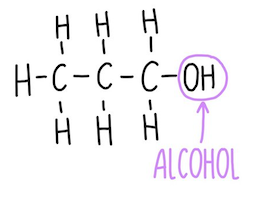

# Alcohols

|                  |                      |
| ---------------- | -------------------- |
| Functional group | $\ce{OH}$            |
| General formula  | $\ce{C_nH_{2n+1}OH}$ |
| Suffix           | -ol                  |

## Making ethanol

### Addition (hydration) with steam

$$
\ce{C2H4 + \underset{\text{steam}}{H2O}} \xrightleftharpoons[\text{phosphoric acid}]{300\degree\text{C + 60 atm}} \ce{C2H5OH}
$$

### Fermentation from glucose

$$
\underset{\text{glucose}}{\ce{C6H12O6}} \xrightarrow[\text{enzymes in yeast}]{\text{30\degree C}} \ce{2C2H5OH + 2CO2}
$$

### Comparison

| Hydration with steam             | Fermentation                   |
| -------------------------------- | ------------------------------ |
| ❌ Non-renewable (oil)           | ✅ Renewable (sugar cane)      |
| ✅ Fast                          | ❌ Slow                        |
| ✅ Continuous process, efficient | ❌ Batch process, inefficient  |
| ✅ Pure ethanol produced         | ❌ Impure ethanol produced     |
| ❌ High temperature/pressure     | ✅ Normal temperature/pressure |
