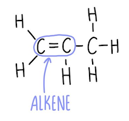

# Alkenes

> Unsaturated (double bonds)

|                  |                  |
| ---------------- | ---------------- |
| Functional group | $\ce{C=C}$       |
| General formula  | $\ce{C_nH_{2n}}$ |
| Suffix           | -ene             |

## Reactions

### Combustion

#### Complete combustion

Excess oxygen \
Release more energy

$$
\begin{aligned}
    \text{alkane + oxygen} &\rightarrow \text{carbon dioxide + water} \\
    \ce{C2H4 + 3O2} &\rightarrow \ce{2CO2 + 2H2O}
\end{aligned}
$$

#### Incomplete combustion

Insufficient oxygen \
Release less energy

$$
\begin{aligned}
    \text{alkane + oxygen} &\rightarrow \text{carbon monoxide + water} \\
    \ce{C2H4 + 2O2} &\rightarrow \ce{2CO + 2H2O}
\end{aligned}
$$

### Addition

Unsaturated to saturated \
Only one product

#### Hydrogenation

$$
\begin{aligned}
    \text{alkene + hydrogen} &\xrightarrow{\text{nickel \scriptscriptstyle (catalyst)}} \text{alkane} \\
    \ce{C2H4 + H2} &\xrightarrow{~~~~~~~~~~~~~~~~~~~~~~~} \ce{C2H6}
\end{aligned}
$$

#### Hydration

$$
\begin{aligned}
    \text{alkene + water \scriptsize(steam)} &\xrightarrow{\text{acid \scriptscriptstyle (catalyst)}} \text{alcohol} \\
    \ce{C2H4 + H2O} &\xrightarrow{~~~~~~~~~~~~~~~~~~~~} \ce{C2H5OH}
\end{aligned}
$$

#### Halogenation

$$
\begin{aligned}
    \text{alkene + halogen} &\xrightarrow{} \text{haloalkane} \\
    \ce{C2H4 + Br2} &\xrightarrow{} \ce{\underset{1,2-dibromoethane}{C2H4Br2}}
\end{aligned}
$$
