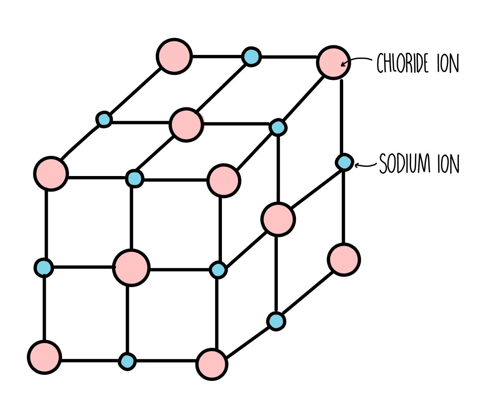

# Bonds

## Ionic bond

Donating/receiving electrons

> Electrostatic attraction force between ions

**Giant ionic lattice** \
Regular arragement of alternating +ve and -ve ions \

#### Properties

-   High melting & boiling point
-   Good electrical conductor (molten/aqueous) \
    Poor electrical conductor (solid)
-   Most can dissolve in water

## Covalent bond

Sharing a **pair** of electrons

> Intermolecular attraction force between non-metals

#### Properties

-   Low melting & boiling point
-   Poor electrical conductor

### Giant covalent structure

> Many atoms covalently bonded in a huge network

#### Properties

-   High melting & boiling point

|                        |                                                                               | Properties                                                                                              |
| ---------------------- | ----------------------------------------------------------------------------- | ------------------------------------------------------------------------------------------------------- |
| **Diamond**            |                         | <ul><li><nobr>Poor conductor of</nobr> electricity</li><li>Hard</li><li>Each atom has 4 bonds</li></ul> |
| **Graphite**           |                    | <ul><li>Good conductor of electricity</li><li>Soft & slippery</li></ul>                                 |
| **Silicon (IV) oxide** |  | <ul><li>Poor conductor of electricity</li><li>Hard</li><li>Each silicon atom has 4 bonds</li></ul>      |

## Metallic bond

see [Metals](./metals.md)

> Positive ions in giant metallic lattice \
> Sea of delocalised electrons \
> Electrostatic attraction force between positive ions and electrons

#### Properties

-   High melting & boiling point
-   Good electrical conductor
-   Malleable
-   Ductile (drawn into wires)
