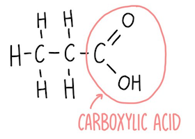
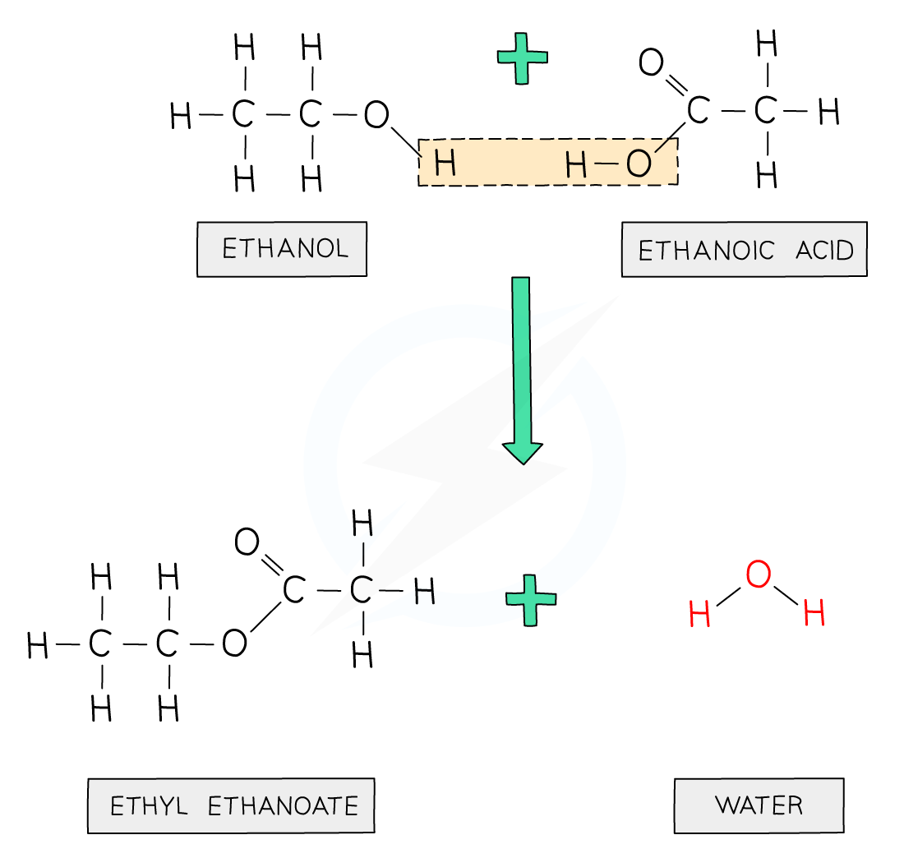

# Carboxylic Acids

|                  |                        |
| ---------------- | ---------------------- |
| Functional group | $\ce{COOH}$            |
| General formula  | $\ce{C_nH_{2n+1}COOH}$ |
| Suffix           | -anoic acid            |

Weak acid - does not fully disassociate into $\ce{H+}$ ions

## Reactions

### Acid reactions

$$
\begin{aligned}
    \ce{\text{carboxylic acid} + \text{alkali} &-> \text{carboxylate salt} + \text{water} \\}
    \ce{\text{carboxylic acid} + \text{metal} &-> \text{carboxylate salt} + \text{hydrogen} \\}
    \ce{\text{carboxylic acid} + \text{metal oxide} &-> \text{carboxylate salt} + \text{water} \\}
    \ce{\text{carboxylic acid} + \text{metal carbonate} &-> \text{carboxylate salt} + \text{water} + \text{carbon dioxide}}
\end{aligned}
$$

### Esterification

$$
\begin{aligned}
    \ce{\text{alcohol} + \text{carboxylic acid} -> \text{ester} + \text{water}}
\end{aligned}
$$

