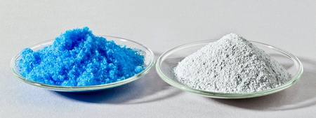
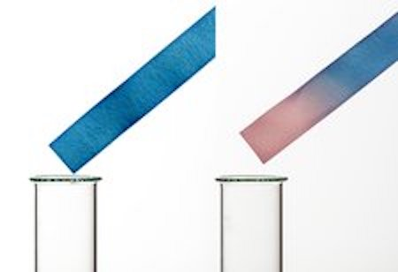
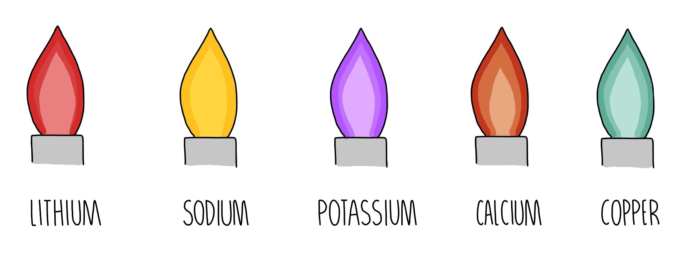

# Chemical Tests

## Gas tests

### Hydrogen

Lighted wooden splinter → pop sound

### Oxygen

Glowing wooden splinter → relights

### Carbon dioxide

Turns **limewater** cloudy \
$\mathrm{Ca(OH)_2 + CO_2 \rightarrow CaCO_3 + H_2O}$

### Ammonia

Turns damp litmus paper blue \
Forms ammonium hydroxide ($\mathrm{NH_4OH}$) in presence of water.

### Chlorine

Turns damp litmus paper red then bleaches it white \
Forms hydrochloric acid ($\mathrm{HCl}$) in presence of water.

### Sulfur dioxide

Turns **acidified aqueous potassium manganate (VII)** from purple to colourless

## Water tests

#### Copper (II) Sulfate

Anhydrous copper (II) sulfate turns from white to blue \
$\mathrm{CuSO_4 + 5H_2O \rightleftharpoons CuSO_4 \cdot 5H_2O}$

#### Cobalt (II) chloride

Anhydrous cobalt (II) chloride paper turns from blue to pink \
$\mathrm{CoCl_2 + 6H_2O \rightleftharpoons CoCl_2 \cdot 6H_2O}$

## Flame tests

| Cation             | Flame colour |
| ------------------ | ------------ |
| $\mathrm{Li^+}$    | red          |
| $\mathrm{Na^+}$    | yellow       |
| $\mathrm{K^+}$     | lilac        |
| $\mathrm{Ca^{2+}}$ | orange-red   |
| $\mathrm{Ba^{2+}}$ | light green  |
| $\mathrm{Cu^{2+}}$ | blue-green   |

## Cation tests

| Cation              | Add sodium hydroxide $\mathrm{NaOH}$                                                 | Add aqueous ammonia $\mathrm{NH_3}$                                                  |
| ------------------- | ------------------------------------------------------------------------------------ | ------------------------------------------------------------------------------------ |
| $\mathrm{NH_4\\^+}$ | **ammonia gas** on warming $\mathrm{NH_3}$                                           |                                                                                      |
| $\mathrm{Cu^{2+}}$  | **light blue** precipitate   insoluble in excess                                  | **light blue** precipitate   soluble in excess, turns dark blue                   |
| $\mathrm{Fe^{2+}}$  | **green** precipitate   insoluble in excess, turns brown near surface on standing | **green** precipitate   insoluble in excess, turns brown near surface on standing |
| $\mathrm{Fe^{3+}}$  | **red-brown** precipitate   insoluble in excess                                   | **red-brown** precipitate   insoluble in excess                                   |
| $\mathrm{Al^{3+}}$  | **white** precipitate   soluble in excess, turns colourless                       | **white** precipitate   insoluble in excess                                       |
| $\mathrm{Ca^{2+}}$  | **white** precipitate   insoluble in excess                                       | **no** precipitate / very **slight white** precipitate                               |
| $\mathrm{Zn^{2+}}$  | **white** precipitate   soluble in excess, turns colourless                       | **white** precipitate   soluble in excess, turns colourless                       |
| $\mathrm{Cr^{3+}}$  | **green** precipitate   soluble in excess                                         | **green** precipitate   insoluble in excess                                       |

## Negative ion tests

### Halide ions

Add dilute nitric acid ($\mathrm{HNO_3}$) first to remove carbonate or sulfate ions.

| Anion           | Result after adding silver nitrate $\mathrm{AgNO3}$ |
| --------------- | --------------------------------------------------- |
| $\mathrm{Cl^-}$ | **white** precipitate                               |
| $\mathrm{Br^-}$ | **creamy** precipitate                              |
| $\mathrm{I^-}$  | **yellow** precipitate                              |

### Carbonate ion ($\mathrm{CO_3\\^{2-}}$)

Dilute acid → carbon dioxide

### Nitrate ion ($\mathrm{NO_3\\^-}$)
Sodium hydroxide and aluminium foil, warm → ammonia (NH3)

### Sulfate ion ($\mathrm{SO_4\\^{2-}}$)

Barium chloride (BaCl) → white precipitate - barium sulfate (BaSO4)

### Sulfite ion ($\mathrm{SO_3\\^{2-}}$)

Acidified aqueous potassium manganate (VII) changes from purple to colourless
