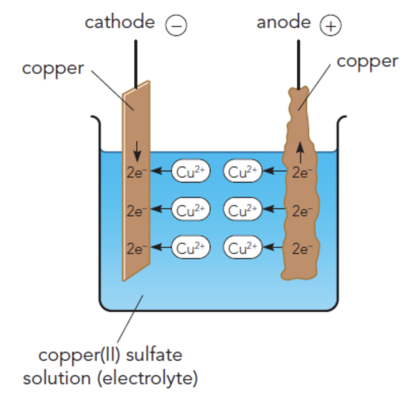

# Electrolysis

> Breakdown using electricity \
> of molten/aqueous ionic compound (electrolyte)
>
> 

> <b>Electrodes</b> (inert)
>
> -   Graphite
> -   Platinum

 

**Cation** → (+) positively charged ion (attracted to cathode) \
**Anion** → (-) negatively charged ion (attracted to anode)

## Molten electrolytes

| Anode             | Cathode        |
| ----------------- | -------------- |
| Anion (non-metal) | Cation (metal) |

## Aqueous electrolytes

$\ce{\underset{water}{H2O} -> H+ + OH-}$

#### Half ionic equations

$$
\begin{align*}
    \ce{2H+ + 2e &-> H2} \\
    \ce{4OH- + 4e &-> 2H2O + O2}
\end{align*}
$$

### Anode

| Highest priority     |                     |
| -------------------- | ------------------- |
| Concentrated halides | $\ce{Cl-, Br-, I-}$ |
| **Hydroxide**        | $\ce{OH-}$          |
| Dilute halides       | $\ce{Cl-, Br-, I-}$ |
| Everything else      |                     |
| **Lowest priority**  |                     |

### Cathode

| Highest priority         |              |
| ------------------------ | ------------ |
| Silver ions              | $\ce{Ag+}$   |
| Copper ions              | $\ce{Cu^2+}$ |
| Hydrogen ion $\ce{(H+)}$ | $\ce{H+}$    |
| Everything else          |              |
| **Lowest priority**      |              |

## Electroplating

| Anode   | Cathode                | Electrolyte              |
| ------- | ---------------------- | ------------------------ |
| Metal X | Object to electroplate | Salt solution of metal X |

 

**At anode** - Copper atoms lose electrons and become ions \
**At cathode** - Copper ions gain electrons and become atoms
