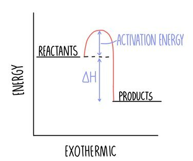
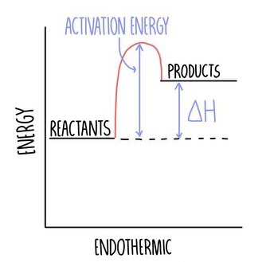

## Activation energy $(E_{\mathrm{a}})$

> Minimum energy colliding particles must have to react

## Enthalpy change $(\mathrm{\Delta H})$

> Overall energy change of reaction
>
> $$\mathrm{\Delta H} = \underset{\text{(energy in)}}{\text{energy to break bonds}} - \underset{\text{(energy out)}}{\text{energy released making bonds}}$$
>
> $$
> \begin{align*}
>   \mathrm{\Delta H} &< 0 \enspace \text{\small exothermic} \\
>   \mathrm{\Delta H} &> 0 \enspace \text{\small endothermic}
> \end{align*}
> $$

 

# Exothermic

> Heat energy is released \
> More energy is released than absorbed
>
> -   Combustion
> -   Neutralisation
> -   Oxidisation

 

$\mathrm{\Delta H} < 0 \enspace\scriptsize\mathrm{(-ve)}$

# Endothermic

> Heat energy is absorbed \
> More energy is absorbed than released
>
> -   Thermal decomposition

 

$\mathrm{\Delta H} > 0 \enspace\scriptsize\mathrm{(+ve)}$
