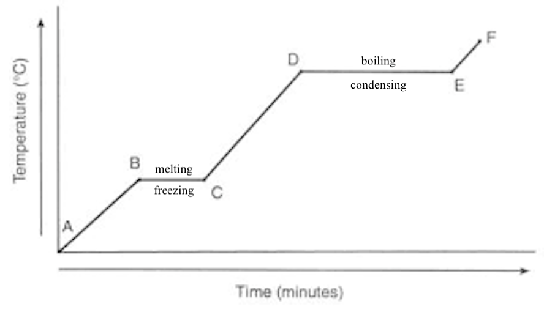

# Heating/Cooling Curve

Temperature is constant during change of physical state (B → C, D → E) because:

> **Heating**: Heat energy is used to break bonds (potential energy) instead of increasing temperature (kinetic energy)

> **Cooling**: Energy is released from forming bonds (potential energy) instead of from decreasing temperature (kinetic energy)

## Heating

- A → B
    - Solid
    - Kinetic energy ⤴️
- B → C
    - Solid → Liquid (Melting)
    - Potential energy ⤴️
- C → D
    - Liquid
    - Kinetic energy ⤴️
- D → E
    - Liquid → Gas (Boiling)
    - Potential energy ⤴️
- E → F
    - Gas
    - Kinetic energy ⤴️
## Cooling

- F → E
    - Gas
    - Kinetic energy ⤵️
- E → D
    - Gas → Liquid (Condensation)
    - Potential energy ⤵️
- D → C
    - Liquid
    - Kinetic energy ⤵️
- C → B
    - Liquid → Solid (Freezing)
    - Potential energy ⤵️
- B → A
    - Solid
    - Kinetic energy ⤵️
