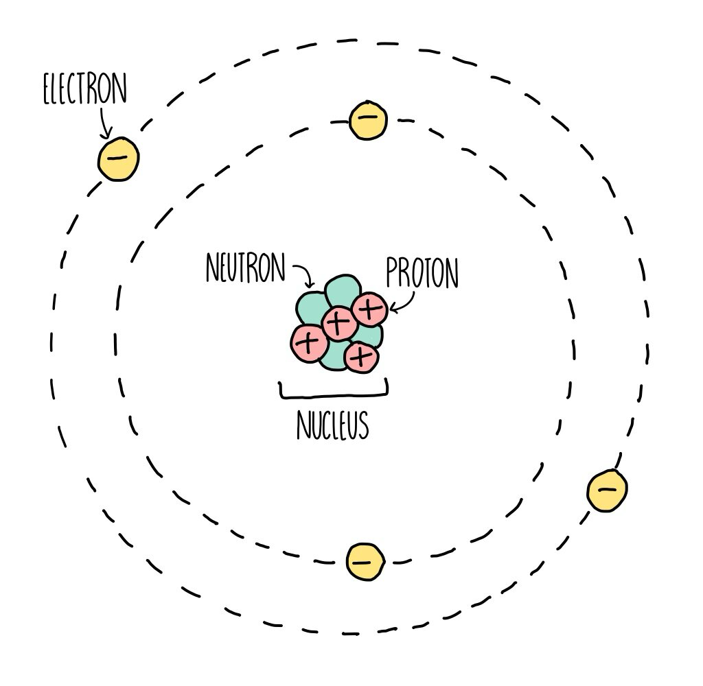

# Matter

## Atoms

|          | Mass[^1] | Charge[^2] |
| -------- | -------- | ---------- |
| Proton   | 1        | +1         |
| Neutron  | 1        | 0          |
| Electron | 1/1840   | -1         |

## Isotopes

> Atoms of the same element (same number of protons) \
> Different number of neutrons

## Elements

> Atoms with the same atomic number

## Compounds

> Two or more elements chemically bonded

## Mixtures

> Two or more substances not chemically bonded

 

[^1]: Unit: Elementary charge $(e)$, equal to charge of a proton.
[^2]: Unit: Atomic mass unit $(u)$, equal to 1/12 of a carbon-12 atom.
