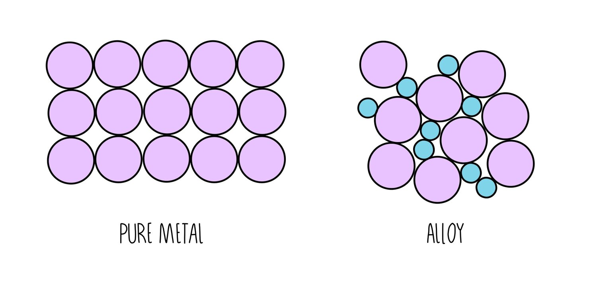

# Metals

see [Metallic bond](./bonds.md#metallic-bond)

## Reactions

$$
\begin{align*}
  \ce{metal + acid &-> salt + hydrogen} \\
  \ce{metal + cold water &-> hydroxide salt + hydrogen} \\
  \ce{metal + steam &-> oxide salt + hydrogen} \\
\end{align*}
$$

## Alloys

-   Harder & stronger
    -   Atoms of different sizes
    -   Layers cannot slide past each other

#### Examples

**Brass** - copper + zinc \
**Stainless steel** - iron + chromium
