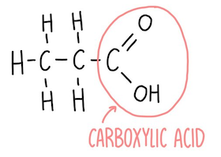

# Organic Compounds

### Formulae

| Type               | Example: Propene                                                      |
| ------------------ | --------------------------------------------------------------------- |
| General formula    | $\ce{C_nH_{2n}}$                                                      |
| Empirical formula  | $\ce{CH2}$                                                            |
| Molecular formula  | $\ce{C3H6}$                                                           |
| Displayed formula  |  |
| Structural formula | $\ce{CH3CH=CH2}$                                                      |

### Homologous series

-   Same general formula
-   Same functional group
-   Similar chemical properties
-   Trends in physical properties
-   Next member increase by one unit

### General properties

-   Chain length ⬆
    -   Boiling point ⬆
    -   Viscosity ⬆
    -   Volatility ⬇
    -   Flammability ⬇

## Organic compounds

| Family                                       | Suffix    | General formula        | Functional group                                                                                                                        |
| -------------------------------------------- | --------- | ---------------------- | --------------------------------------------------------------------------------------------------------------------------------------- |
| **Alkanes** Saturated (single bonds)   | -ane      | $\ce{C_nH_{2n+2}}$     | -                                                                                                                                       |
| **Alkenes** Unsaturated (double bonds) | -ene      | $\ce{C_nH_{2n}}$       |  $\ce{C=C}$                                                        |
| **Alcohols**                                 | -ol       | $\ce{C_nH_{2n+1}OH}$   |  $\ce{OH \text{ \scriptsize(hydroxyl group)}}$                   |
| **Carboxylic acids** (Weak acid)          | -oic acid | $\ce{C_nH_{2n+1}COOH}$ |  $\ce{COOH \text{ \scriptsize(carboxyl group)}}$ |
| **Esters**                                   | -         | -                      |  $\ce{COO}$                                                          |
