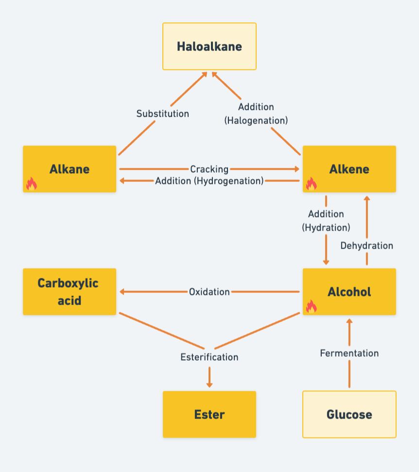
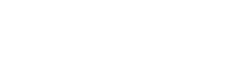
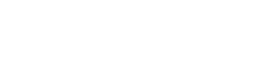
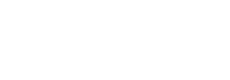
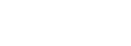

# Organic reactions

## Combustion

### Complete combustion

**Conditions:** Excess oxygen \
Release more energy

$$
\begin{align*}
  \ce{alkane + oxygen &-> carbon dioxide + water} \\
  \ce{alkene + oxygen &-> carbon dioxide + water} \\
  \ce{alcohol + oxygen &-> carbon dioxide + water} \\
\end{align*}
$$

### Incomplete combustion

**Conditions:** Insufficient oxygen \
Release less energy

$$
\begin{align*}
    \ce{alkane + oxygen &-> carbon monoxide + water} \\
    \ce{alkene + oxygen &-> carbon monoxide + water} \\
    \ce{alcohol + oxygen &-> carbon monoxide + water} \\
\end{align*}
$$

## Cracking <small>alkane</small>

Breaks down large molecules into smaller ones

**Conditions:** 540˚C \
**Catalyst:** zeolite

$$\ce{alkane ->[540\degree \text{C}][\text{zeolite}] smaller alkane \scriptsize(or hydrogen)} + \text{alkenes \scriptsize(one or more)}$$

## Substitution <small>alkane</small>

Photochemical reaction \
Hydrogen atom swapped with another atom

**Conditions:** UV light

UV light = activation energy $E_a$

$$\ce{alkane + halogen ->[UV light] haloalkane + hydrogen halide}$$

## Addition <small>alkene</small>

Forms only one product

### Hydrogenation

**Conditions:** heat + pressure \
**Catalyst:** nickel

$$\ce{alkene + hydrogen ->[heat + pressure][nickel \scriptscriptstyle] alkane} \\$$

### Halogenation

**Conditions:** -

$$\ce{alkene + halogen -> haloalkane}$$

### Hydration

**Conditions:** 300˚C + 60 atm \
**Catalyst:** phosphoric acid $\ce{(H3PO4)}$

$$\ce{alkene + \underset{steam}{water} ->[300\degree \text{C + 60 atm}][phosphoric acid] alcohol}$$

## Dehydration <small>alcohol</small>

Reverse of hydration

**Conditions:** heat \
**Catalyst:** alumina (aluminium oxide) $\ce{(Al2O3)}$

$$\ce{alcohol ->[heat][alumina] alkene + water}$$

## Fermentation <small>glucose</small>

**Conditions:** 30˚C + no oxygen \
**Catalyst:** yeast enzymes

$$\ce{\underset{glucose}{C6H12O6} ->[\text{30\degree C}][yeast enzymes] \underset{ethanol}{2C2H5OH} + 2CO2}$$

## Oxidation <small>alcohol</small>

### Oxidising agent (chemical)

**Oxidising agent:** Acidified aqueous potassium manganate (VII) $\ce{(KMnO4)}$

$$\ce{alcohol + [O] -> carboxylic acid + water}$$

### Fermentation (biological)

Bacteria

$$\ce{alcohol + oxygen ->[][bacteria] carboxylic acid + water}$$

## Esterification

**Conditions:** - \
**Catalyst:** concentrated sulfuric acid $\ce{(H2SO4)}$

$$\ce{alcohol + carboxylic acid <=>[][conc. sulfuric acid] ester + water}$$

