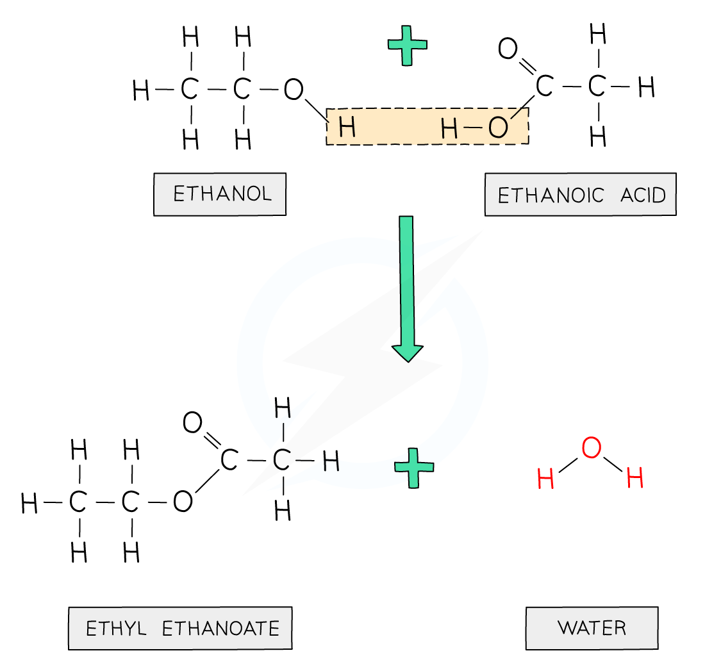

# Organic reactions

## Combustion

### Complete combustion

**Conditions:** Excess oxygen \
Release more energy

$$
\begin{aligned}
  \text{alkane + oxygen} &\rightarrow \text{carbon dioxide + water} \\
  \text{alkene + oxygen} &\rightarrow \text{carbon dioxide + water} \\
  \text{alcohol + oxygen} &\rightarrow \text{carbon dioxide + water} \\
\end{aligned}
$$

### Incomplete combustion

**Conditions:** Insufficient oxygen \
Release less energy

$$
\begin{aligned}
    \text{alkane + oxygen} &\rightarrow \text{carbon monoxide + water} \\
    \text{alkene + oxygen} &\rightarrow \text{carbon monoxide + water} \\
    \text{alcohol + oxygen} &\rightarrow \text{carbon monoxide + water} \\
\end{aligned}
$$

## Cracking <small>alkane</small>

Breaks down large molecules into smaller ones

**Conditions:** 540˚C \
**Catalyst:** zeolite

$$\text{alkane} \xrightarrow[\text{zeolite}]{540\degree \text{C}} \text{smaller alkane \scriptsize(or hydrogen)} + \text{alkenes \scriptsize(one or more)}$$

## Substitution <small>alkane</small>

Photochemical reaction \
Hydrogen atom swapped with another atom

**Conditions:** UV light

UV light = activation energy $E_a$

$$\text{alkane + halogen} \xrightarrow{\text{UV light}} \text{haloalkane + hydrogen halide}$$

## Addition <small>alkene</small>

Forms only one product

### Hydrogenation

**Conditions:** heat + pressure \
**Catalyst:** nickel

$$\text{alkene + hydrogen} \xrightarrow[\text{nickel \scriptscriptstyle}]{\text{heat + pressure}} \text{alkane} \\$$

### Halogenation

**Conditions:** -

$$\text{alkene + halogen} \xrightarrow{} \text{haloalkane}$$

### Hydration

**Conditions:** 300˚C + 60 atm \
**Catalyst:** phosphoric acid $\ce{(H3PO4)}$

$$\text{alkene} + \underset{\text{steam}}{\text{water}} \xrightarrow[\text{phosphoric acid}]{300\degree \text{C + 60 atm}} \text{alcohol}$$

## Dehydration <small>alcohol</small>

Reverse of hydration

**Conditions:** heat \
**Catalyst:** alumina (aluminium oxide) $\ce{(Al2O3)}$

$$\text{alcohol} \xrightarrow[\text{alumina}]{\text{heat}} \text{alkene + water}$$

## Fermentation <small>glucose</small>

**Conditions:** 30˚C + no oxygen \
**Catalyst:** yeast enzymes

$$\underset{\text{glucose}}{\ce{C6H12O6}} \xrightarrow[\text{yeast enzymes}]{\text{30\degree C}} \ce{\underset{\text{ethanol}}{2C2H5OH} + 2CO2}$$

## Oxidation <small>alcohol</small>

### Oxidising agent (chemical)

**Oxidising agent:** Potassium manganate (VII) $\ce{(KMnO4)}$

$$\text{alcohol} + \text{[O]} \xrightarrow[]{} \text{carboxylic acid} + \text{water}$$

### Fermentation (biological)

Bacteria

$$\text{alcohol} + \text{oxygen} \xrightarrow[\text{bacteria}]{} \text{carboxylic acid} + \text{water}$$

## Esterification

**Conditions:** - \
**Catalyst:** concentrated sulfuric acid $\ce{(H2SO4)}$

$$\text{alcohol} + \text{carboxylic acid} \xrightleftharpoons[\text{conc. sulfuric acid}]{} \text{ester} + \text{water}$$

<!--  -->
