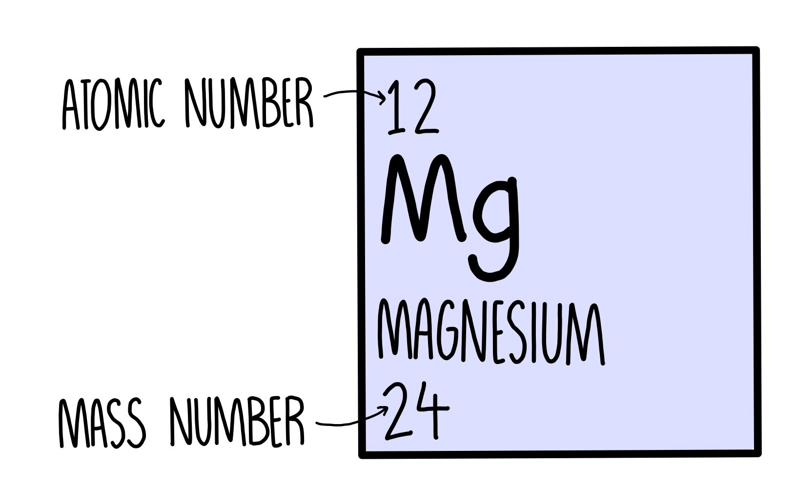

-   [Alkali metals (Group I)](#alkali-metals-group-i)
-   [Halogens (Group VII)](#halogens-group-vii)
-   [Transition elements](#transition-elements)
-   [Noble gases](#noble-gases)

 

# Periodic Table

Period = row = number of shells \
Group = column = number of outer shell electrons

Left to right

-   metallic character ⬇

Top to bottom

-   density ⬆

## Alkali metals (Group I)

Top to bottom

-   reactivity ⬆
-   melting/boiling point ⬇

 

> 
>
> **Reactivity & melting point** \
> ⬇ attractive force on valence electron, ⬆ reactive, ⬇ melting/boiling point

## Halogens (Group VII)

Top to bottom

-   reactivity ⬇
-   melting/boiling point ⬆

 

> 
>
> **Reactivity** \
> ⬇ attractive force on other electrons, ⬇ reactive
>
> **Melting/Boiling point** \
> ⬆ molecule size, ⬆ melting/boiling point

## Transition metals

#### Properties (compared with non-transition metals)

| Chemical properties                                                                           | Physical properties                                                                     |
| --------------------------------------------------------------------------------------------- | --------------------------------------------------------------------------------------- |
| <ul><li>Variable oxidation number</li><li>Forms coloured compounds</li><li>Catalyst</li></ul> | <ul><li>Higher melting point</li><li>Higher density</li><li>Stronger & harder</li></ul> |

## Noble gases

-   Full outer shell
-   Unreactive
-   Monoatomic
