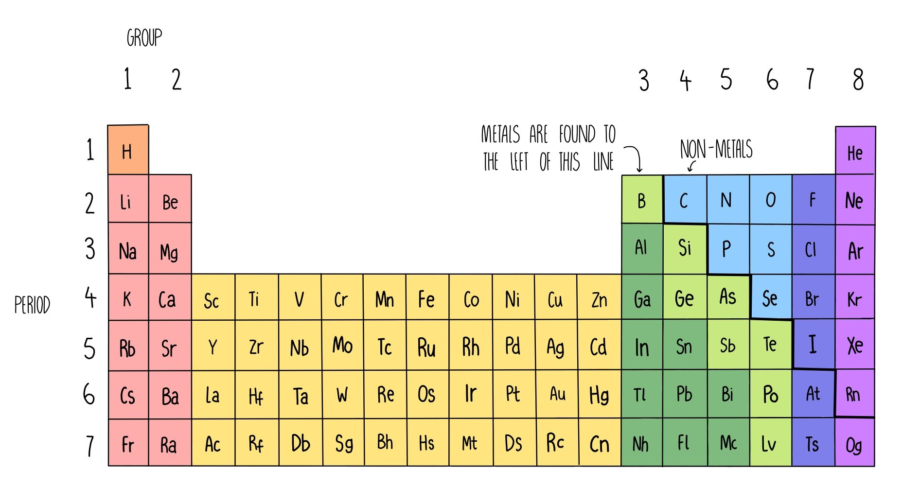
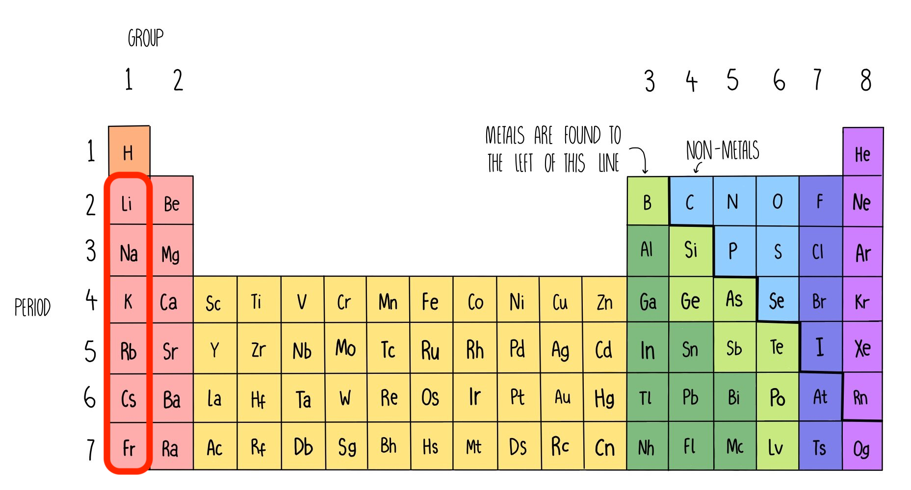
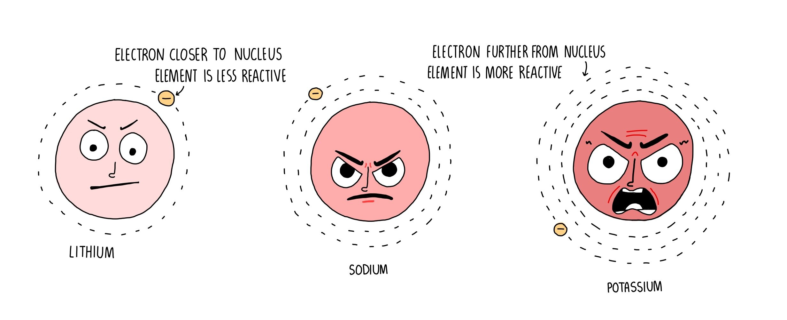
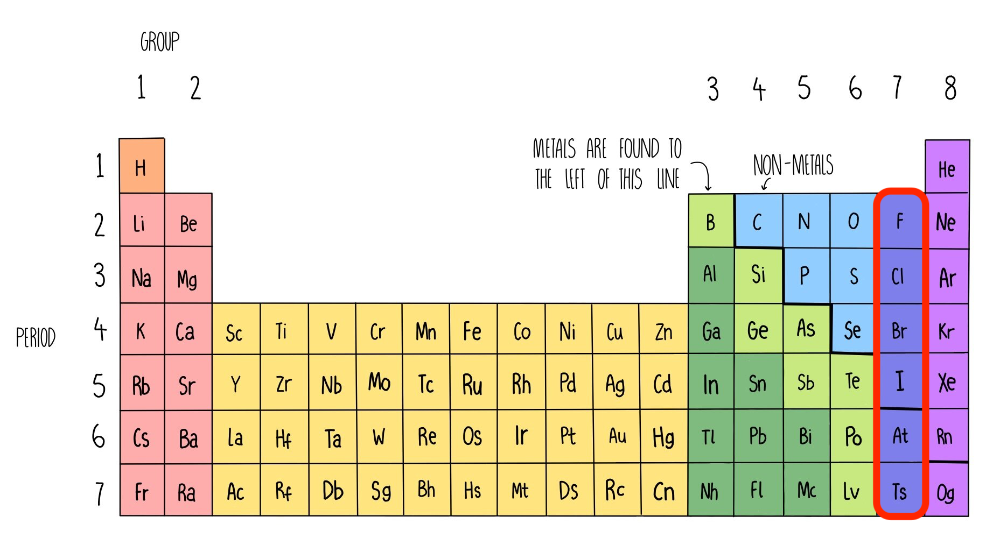
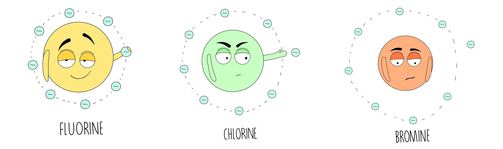
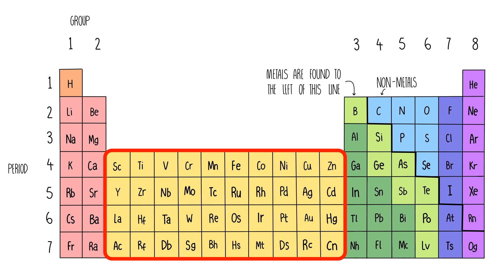

# Periodic Table

Period = row = number of shells \
Group = column = number of valence electrons

Left to right

- metallic character ⬇

Top to bottom

- density ⬆

## Alkali metals (Group I)

Top to bottom

- reactivity ⬆
- melting point ⬇

 

> 
>
> **Reactivity & melting point** \
> ⬇ attractive force on valence electron, ⬆ reactive, ⬇ melting point

## Halogens (Group VII)

Top to bottom

- reactivity ⬇
- boiling point ⬆

 

> 
>
> **Reactivity** \
> ⬇ attractive force on other electrons, ⬇ reactive
>
> **Boiling point** \
> ⬆ molecule size, ⬆ boiling point

## Transition elements

#### Properties (compared with non-transition metals)

| Chemical properties                                                                           | Physical properties                                                            |
| --------------------------------------------------------------------------------------------- | ------------------------------------------------------------------------------ |
| <ul><li>Variable oxidation number</li><li>Forms coloured compounds</li><li>Catalyst</li></ul> | <ul><li>Higher melting point</li><li>Higher density</li><li>Stronger</li></ul> |

## Noble gases

- Full outer shell
- Unreactive
- Monoatomic
