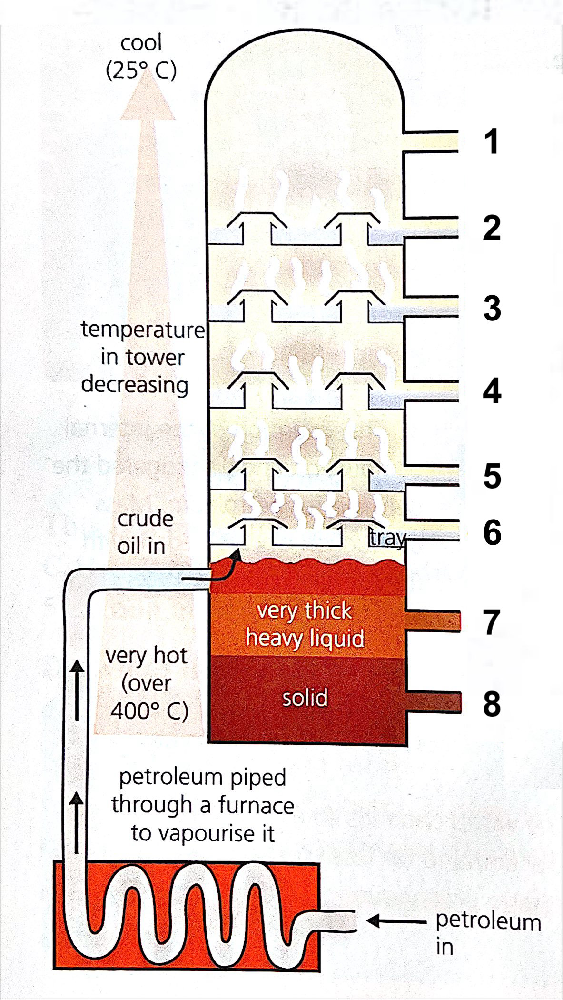

# Petroleum

-   Chain length ⬆
    -   Melting/boiling point ⬆
    -   Viscosity ⬆
    -   Volatility ⬇
    -   Darker colour

 

Fractional distillation

|       | Fraction                | # of carbon atoms        | Uses                                                                                |
| ----- | ----------------------- | ------------------------ | ----------------------------------------------------------------------------------- |
| **1** | Refinery gas            | $\ce{C1}$ to $\ce{C4}$   | <ul><li>Cooking</li><li>Heating</li></ul>                                           |
| **2** | Gasoline                | $\ce{C5}$ to $\ce{C6}$   | <ul><li>Car fuel</li></ul>                                                          |
| **3** | Naphtha                 | $\ce{C6}$ to $\ce{C10}$  | <ul><li>Feedstock for chemicals/plastics</li></ul>                                  |
| **4** | Kerosene                | $\ce{C10}$ to $\ce{C15}$ | <ul><li>Aircraft fuel</li><li>Oil stoves/lamps</li></ul>                            |
| **5** | Diesel oil              | $\ce{C15}$ to $\ce{C20}$ | <ul><li>Diesel engine fuel</li></ul>                                                |
| **6** | Fuel oil                | $\ce{C20}$ to $\ce{C30}$ | <ul><li>Power station fuel</li><li>Ship fuel</li><li>Home heating systems</li></ul> |
| **7** | Lubricating fraction | $\ce{C30}$ to $\ce{C50}$ | <ul><li>Car engine / machinery oil</li><li>Wax / polish</li></ul>                   |
| **8** | Bitumen                 | $\ce{C50}$ upwards       | <ul><li>Roads</li><li>Roofs</li></ul>                                               |
