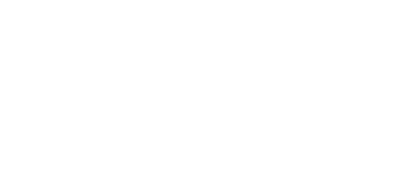
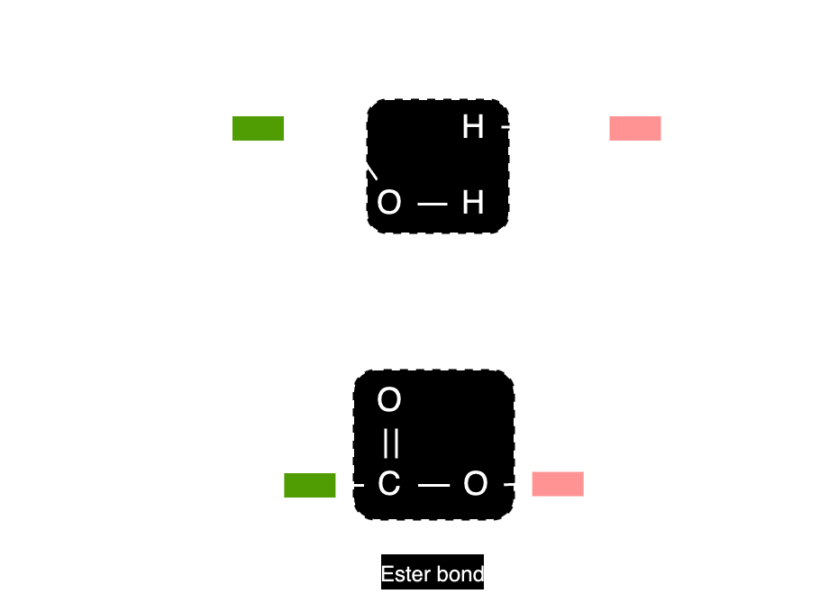

# Polymerisation

Macromolecules (large) built up from monomers (small)

## Addition polymerisation

**Reactant:** one type of monomer (C=C) \
**Product:** one polymer

Conditions: Heat, pressure \
Catalyst

### Polyalkene

Examples: Poly(ethene)

## Condensation polymerisation

**Reactant:** two types of monomers (COOH) \
**Product:** one polymer and water

### Polyester

PET (Terylene) - bottles, mixed with cotton

### Polyamide

Nylon (synthetic) - ropes, fishing nets and lines, tents \

Protein (natural)

