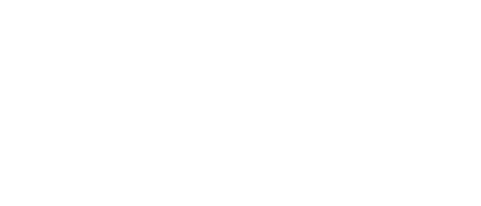
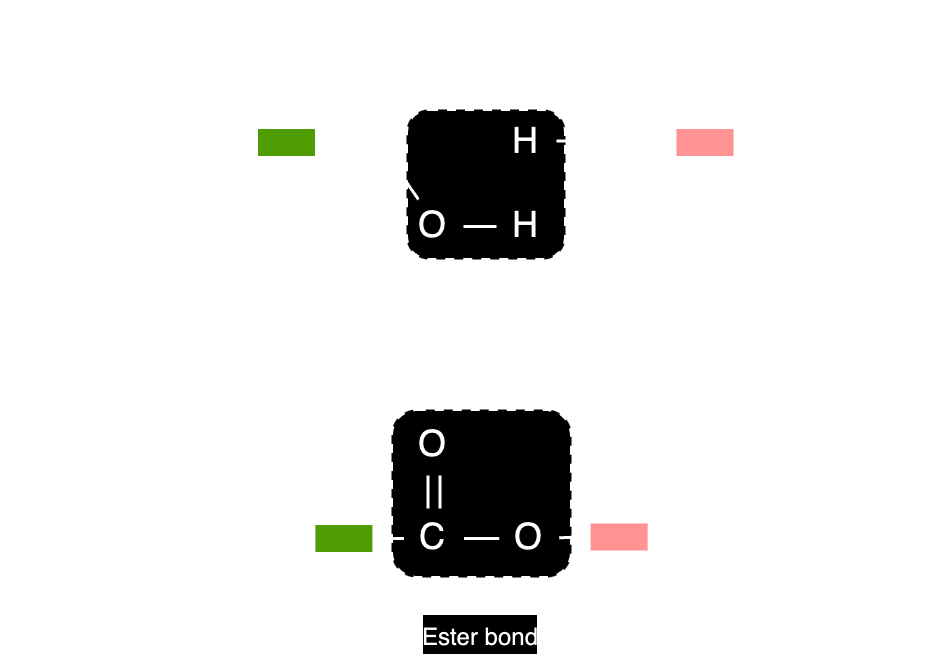
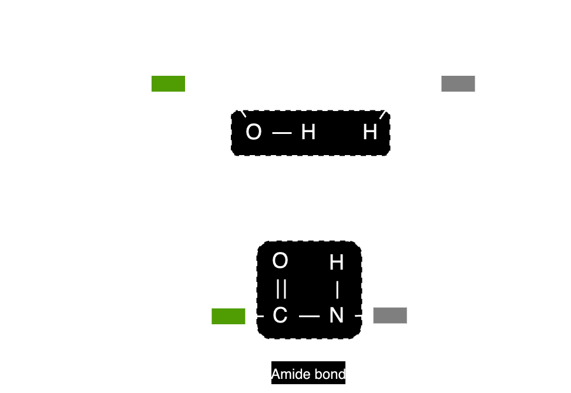
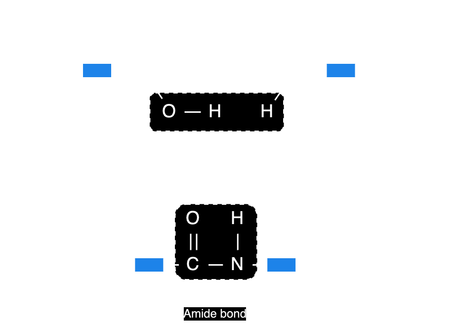

# Polymers

> Macromolecules (large) built up from monomers (small)

## Combustion

### Complete combustion

**Conditions:** Excess oxygen \
Release more energy

$$
\begin{align*}
  \ce{polyalkene + oxygen &-> carbon dioxide + water} \\
  \ce{polyester + oxygen &-> carbon dioxide + water} \\
  \ce{polyamide + oxygen &-> carbon dioxide + nitrogen oxides + water} \\
\end{align*}
$$

### Incomplete combustion

**Conditions:** Insufficient oxygen \
Release less energy

$$
\begin{align*}
    \ce{polyalkene + oxygen &-> carbon monoxide + water} \\
    \ce{polyester + oxygen &-> carbon monoxide + water} \\
    \ce{polyamide + oxygen &-> carbon monoxide + nitrogen oxides + water} \\
\end{align*}
$$

## Addition polymerisation

**Reactant:** one type of alkene \
**Product:** one polymer

Conditions: Heat, pressure \
Catalyst

### Polyalkene

Example: **Poly(ethene)** \
Monomers: Ethene \

## Condensation polymerisation

**Reactant:** two or more monomers (always have a $\ce{COOH}$) \
(not types of monomers!!) \
**Product:** one polymer and water

### Polyester

**PET (Terylene)** - bottles, mixed with cotton \
Monomers: Dicarboxylic acid, diol \

### Polyamide

**Nylon** (synthetic) - ropes, fishing nets and lines, tents \
Monomers: Dicarboxylic acid, diamine \

**Protein** (natural) \
Monomers: Amino acid \

> ### Hydrolysis
>
> **PET** - hydrolyse back into monomers by acids/alkalis
