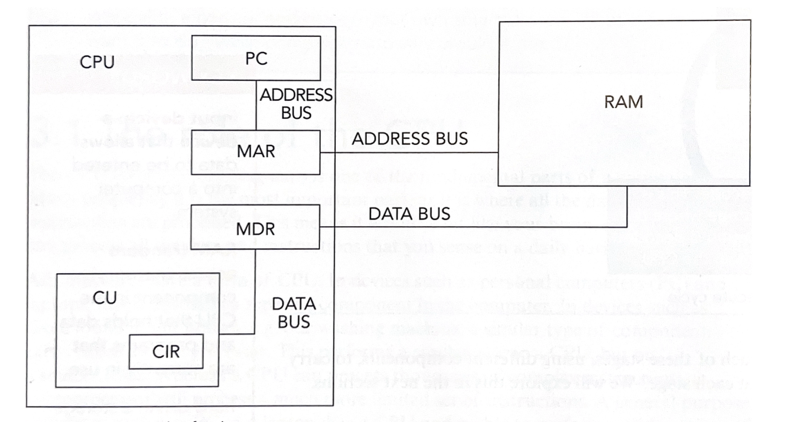

# Hardware

# Components <small>(Von Neumann architecture)</small>

- **CPU (central processing unit)**
    - CU (control unit)
    - ALU (arithmetic logic unit)
    - Registers
        - PC (program counter)
        - MAR (memory address register)
        - MDR (memory data register / buffer)
        - CIR (current instruction register) - inside CU
        - ACC (accumulator) - inside ALU
    - Buses
        - Data bus
        - Address bus
        - Control bus
    - *Core*
    - *Cache*
    - *Clock*
- **Storage**
    - Primary
        - RAM (random access memory)
        - ROM (read only memory)
    - Secondary
        - Magnetic
        - Optical
        - Solid-state
- **Network**
    - NIC (network interface card)
    - Router

 

# CPU

> Input \
> Process data and instructions \
> Output

## FDE cycle[^FDE]

> 

> <b>CU</b> coordinates all operations in CPU
>
> - Transmits control signals to all components
> - Using control bus

### Fetch

1. **PC** stores address of next instruction (to be processed)
   - send to MAR - Address bus
2. **MAR** holds address of data/instruction (to be located in RAM)
   - send to RAM - Address bus
3. RAM retrieves data/instruction
   - send to MDR - Data bus
4. **MDR** holds address of data/instruction (fetched from RAM)
   - send to CIR - Data bus
5. **CIR** stores current instruction (being processed)

### Decode

6. **CU** decodes instruction into machine code
   - Using **instruction set** \
     (set of commands that are understood by CPU)

### Execute

7. **ALU** performs mathematical/logical operations (if needed)
8. **ACC** stores interim values created by calculations

## Performance

- More cores
    - **Core** - contains all components used for FDE cycle
    - Perform multiple FDE cycles at once
- Higher clock speed
    - **Clock** - synchronise components, controls speed of FDE cycle
- More cache
    - **Cache** - fast data storage inside CPU
    - Less time spent fetching data from RAM

## Virtual memory

> Partition in hard drive

If RAM is full

1. **Page** is sent to virtual memory

When page is needed

3. Space made available in RAM
   - Send another page to CPU to process
   - Send another page to virtual memory
4. Page needed is sent back to RAM

 

# Microprocessor
> 

> Integrated circuit on a single chip
>
> - Limited instructions
> - Used in **embedded systems**
>   - Performs a dedicated function only

 

# Storage

## Primary

> Directly accessed by CPU

| RAM                                                                                                       | ROM                                                                                                                 |
| --------------------------------------------------------------------------------------------------------- | ------------------------------------------------------------------------------------------------------------------- |
| 

Volatile<ul><li>Temporary storage</li><li>Contents are lost when power is turned off</li></ul>  | 

Non-volatile<ul><li>Permanent storage</li><li>Contents are preserved even when power is turned off</li></ul> |
| Stores data currently in use                                                                     | 

Stores startup instructions<ul><li>Bootstrap</li><li>BIOS</li></ul>                                          |
| Contents constantly changing                                                                              | Contents fixed                                                                                                |
| Can increase amount of RAM                                                                                | Cannot increase amount of ROM                                                                                       |

## Secondary

> Permanent data storage \
> Has to be sent to primary storage first to be accessed by CPU

|                                    |                                                                                                     |
| ---------------------------------- | --------------------------------------------------------------------------------------------------- |
| Magnetic                           | <ul><li>Uses **electromagnets**</li><li>Spinning platters (separated into tracks/sectors)</li></ul> |
| Optical                            | <ul><li>Uses **lasers**</li><ul><li>Pits/lands</li></ul></ul>                                       |
| Solid-state (flash&nbsp;memory) | <ul><li>Uses **transistors**<ul><li>NAND/NOR</li><li>Control/floating gates</li></ul></li></ul>     |

## Cloud

> Data stored in servers \
> Data can be accessed remotely

 

# Network

## Router

> Routes data to a specific destination on a network

- Connects local network to the internet
- Assigns dynamic IP address

## NIC

> Component for connecting to networks

## MAC address[^MAC]

> Unique identifier \
> Assigned to NIC by manufacturer

> `34:4D:EA:89:75:B2`

- Hexadecimal
- Separated by colons
- Manufacturer code + serial code

## IP address[^IP]

> Unique address

### Static

> Assigned by ISP (internet service provider) \
> Does not change

### Dynamic

> Assigned by router \
> Changes each time device connects to network

### Types of IP addresses

| IPv4                 | IPv6                        |
| -------------------- | --------------------------- |
| `12.244.233.165`     | `2001:0db8::ff00:0042:7879` |
| 32-bit               | 128-bit                     |
| Separated by periods | Separated by colons         |

 

# Videos

- FDE cycle \
  [Craig'n'Dave](https://youtu.be/KBmoqwVt4Qg?si=3MH5FiUI4wUsV4zV&t=353)

 

[^FDE]: Fetch-Decode-Execute
[^MAC]: Media Access Control
[^IP]: Internet Protocol
