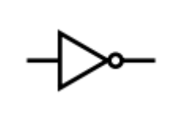
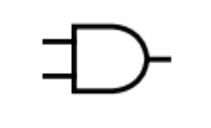
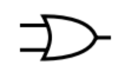
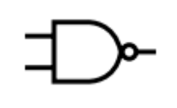
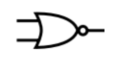
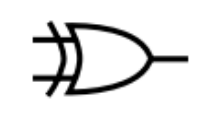

# Logic Gates

- [NOT](#not)
- [AND](#and)
- [OR](#or)
- [NAND](#nand)
- [NOR](#nor)
- [XOR](#xor)

 

> 

> Purpose of logic gates
>
> - Perform logic operations
> - Control flow of electricity
> - Input → apply logic → output

## NOT

> $$
\begin{aligned}
  \text{X} &= \text{NOT A} \\
  \mathrm{X} &= \mathrm{\overline{A}}
\end{aligned}
> $$

| A   | X     |
| --- | ----- |
| 0   | **1** |
| 1   | **0** |

## AND

> $$
\begin{aligned}
  \text{X} &= \text{A AND B} \\
  \mathrm{X} &= \mathrm{A.B}
\end{aligned}
> $$

| A   | B   | X     |
| --- | --- | ----- |
| 0   | 0   | **0** |
| 1   | 0   | **0** |
| 0   | 1   | **0** |
| 1   | 1   | **1** |

## OR

> $$
\begin{aligned}
  \text{X} &= \text{A OR B} \\
  \mathrm{X} &= \mathrm{A+B}
\end{aligned}
> $$

| A   | B   | X     |
| --- | --- | ----- |
| 0   | 0   | **0** |
| 1   | 0   | **1** |
| 0   | 1   | **1** |
| 1   | 1   | **1** |

## NAND

> $$
\begin{aligned}
  \text{X} &= \text{A AND B} \\
  \mathrm{X} &= \mathrm{\overline{A.B}}
\end{aligned}
> $$

| A   | B   | X     |
| --- | --- | ----- |
| 0   | 0   | **1** |
| 1   | 0   | **1** |
| 0   | 1   | **1** |
| 1   | 1   | **0** |

## NOR

> $$
\begin{aligned}
  \text{X} &= \text{A OR B} \\
  \mathrm{X} &= \mathrm{\overline{A+B}}
\end{aligned}
> $$

| A   | B   | X     |
| --- | --- | ----- |
| 0   | 0   | **1** |
| 1   | 0   | **0** |
| 0   | 1   | **0** |
| 1   | 1   | **0** |

## XOR

> $$
\begin{aligned}
  \text{X} &= \text{A XOR B} \\
  \mathrm{X} &= \mathrm{A\oplus B}
\end{aligned}
> $$

| A   | B   | X     |
| --- | --- | ----- |
| 0   | 0   | **0** |
| 1   | 0   | **1** |
| 0   | 1   | **1** |
| 1   | 1   | **0** |
