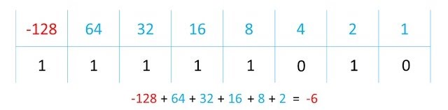

# Binary

> Base 2 number system \
> 0 and 1

## Advantages

- Can be processed by computers

## Operations

### Addition

$$
\begin{aligned}
  0 + 0 &= 0 \\
  1 + 0 &= 1 \\
  1 + 1 &= 10 \\
  1 + 1 + 1 &= 11 \\
\end{aligned}
$$

Overflow error: calculated number is larger than storage space

### Bit shift

Left shift

- Moves bits to the left
- Most significant bits (MSB) lost
- Multiplies number by 2

Right shift

- Moves bits to the right
- Least significant bits (LSB) lost
- Divides number by 2

## Negative binary (two's complement)

Converting:

1. Invert all bits
2. Add 1

 

# Hexadecimal

> Base 16 number system \
> 1-9 and A-F

## Advantages

- Takes up less **screen** space
- Easier to read, write and understand
- Easier to debug

## Uses

- Colour codes
- ASCII / Unicode
- Error codes
- Memory dumps (debugging)
- Assembly
- Machine code
- Memory address
- MAC address
- IP address
- URLs
