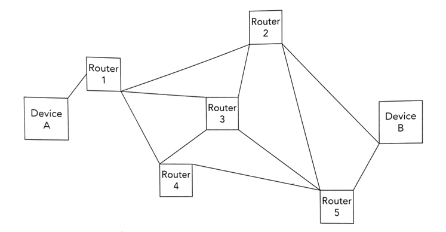

# Packets

- Header
    - Destination address (IP address)
    - Originators address (IP address)
    - Packet number
- Payload
- Trailer

## Packet switching

1. Data split into packets
2. Router controls route \
   Router chooses shortest route \
   Each packet takes different route across network
3. Packets arrive out of order
4. When all packets arrive, reordered
