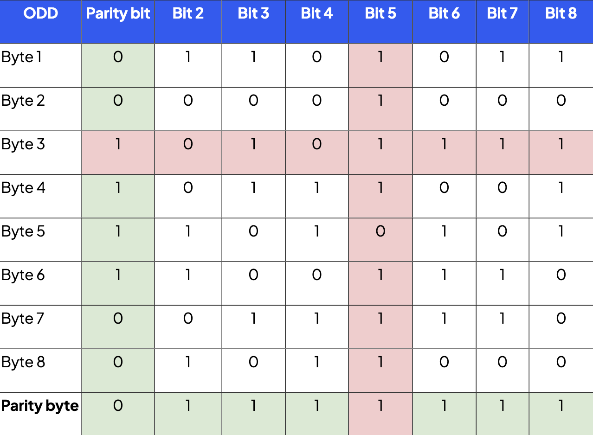

# Error Detection

## During data transmission

### Parity check

-   Extra parity bit added
-   **Odd parity**
    -   Number of on bits = odd
-   **Even parity**
    -   Number of on bits = even

### Parity blocks

-   Can pinpoint specific bit that has error
-   Can detect errors even when even number of errors

### Checksum

-   Calculate value
    -   Before and after transmission
    -   If equal, no error
-   Example:
    -   Modulus 11

### Echo sum

-   Transmit data to receiver
-   Receiver transmit back data
-   If same, no error

 

> ### Automatic repeat request (ARQ)
>
> 1. Packet sent
> 2. Packet received, checks for errors
> 3. Acknowledge
>     - **Positive acknowledgement** \
>       If no error, sends acknowledgement
>     - **Negative acknowledgement** \
>       If has error, sends acknowledgement
> 4. If timeout, continue or send packet again (until reach resend limit)

 

## During data entry

### Check digit

1. Before entry, check digit is calculated (by computer)
2. During entry, check digit entered by human together with data
3. Check digit recalculated - if equal, no error

Example usage:

-   ISBN
-   Barcodes
