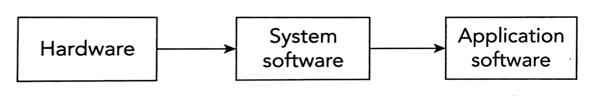

# Software

-   [System Software](#system-software)
    -   [OS](#os)
    -   [Interrupts](#interrupts)
-   [Application Software](#application-software)

 

 

 

# Firmware

> Software embedded into hardware devices (ROM)

-   Loaded when computer starts

# System Software

> Services that the computer requires

-   OS
-   Utility programs

## OS[^OS]

| Function                                               | Description                                                                                                                                                                                                                          |
| ------------------------------------------------------ | ------------------------------------------------------------------------------------------------------------------------------------------------------------------------------------------------------------------------------------ |
| Providing an interface                                 | <ul><li>GUI[^GUI]<ul><li>Windows, icons, menus and pointers (WIMP)</li></ul></li><li>Command line interface</li><li>Natural language interface</li></ul>                                                                             |
| Managing files                                         | <ul><li>Create, delete, move, copy, rename files/folders</li></ul>                                                                                                                                                                   |
| Managing memory                                        | <ul><li>Manage movement of data to/from RAM</li><li>Allocate enough memory for processes</li><li>Prevent two processes from accessing same memory location</li><li>Manage transfer of pages between RAM and virtual memory</li></ul> |
| Managing multitasking                                  | <ul><li>Decide<ul><li>which process should be executed next</li><li>how long they can execute before switching</li></ul></li></ul>                                                                                                   |
| Managing interrupts                                    | <ul><li>Decides which interrupt to run</li></ul>                                                                                                                                                                                     |
| Managing peripherals[^peripheral] and drivers[^driver] | <ul><li>Install drivers</li></ul>                                                                                                                                                                                                    |
| Providing a platform for applications                  | <ul><li>Fetch application software instructions and execute</li></ul>                                                                                                                                                                |
| Managing user accounts                                 | <ul><li>Username & password</li><li>Preferences</li><li>Restrict access / keep data separate</li></ul>                                                                                                                               |
| Providing a security system                            |

## Interrupts

> Signal to processor

1. Each FDE cycle, [IH](#ih) checks interrupt queue for higher priority interrupt
2. Stores current process
3. Checks source of interrupt
4. Calls [ISR](#isr)
5. When finished, stored process returned to memory
6. Repeat

### IH[^IH]

-   Receive/manage all interrupts
-   Organises interrupts based on priorities

### ISR[^ISR]

-   Program
-   Handles the interrupt by performing instructions

#### Types of interrupts

-   **Software**
    -   Division by 0
    -   Two processes attempting to access same memory location
    -   Input requested
    -   Output required
    -   Data required from memory
-   **Hardware**
    -   Data input \
        (Keypress, mouse click)
    -   Error from hardware \
        (Printer out of paper)
    -   Hardware failure
    -   New hardware device connected
    -   Hard drive signal that it has read data

 

# Application Software

> Services that the user requires

-   Word processor / spreadsheet
-   Database
-   Web browser

 

[^OS]: Operating system
[^GUI]: Graphical User Interface
[^peripheral]: External hardware device for input/output
[^driver]: Software that translates data from computer to peripheral
[^IH]: Interrupt Handler
[^ISR]: Interrupt Service Routine
