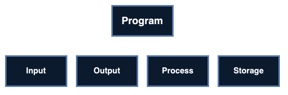
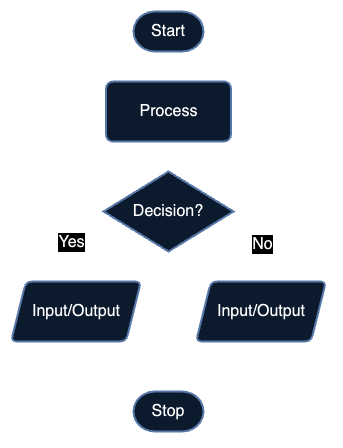

-   [1. Analysis](#1-analysis)
    -   [Decomposition](#decomposition)
    -   [Abstraction](#abstraction)
-   [2. Design](#2-design)
    -   [Structure diagram](#structure-diagram)
    -   [Flowchart](#flowchart)
    -   [Pseudocode](#pseudocode)
-   [3. Coding](#3-coding)
-   [4. Testing](#4-testing)

 

# Program Development Cycle

Types:

-   Cyclic
-   Spiral
-   Waterfall
-   Rapid development

## 1. Analysis

> Identify problem & requirements

### Decomposition

Split a system into sub-systems, \
split sub-systems into smaller sub-systems

### Abstraction

Simplifying \
Select important elements \
Removing unneccesary characteristics from elements

## 2. Design

> Plan the algorithm

### Structure diagram

### Flowchart

### Pseudocode

See [Pseudocode](./pseudocode.md)

## 3. Coding

> Writing program

## 4. Testing

> Detect/fix errors

| Test data |                                                                                                |
| --------- | ---------------------------------------------------------------------------------------------- |
| Normal    | **Accepted** by program                                                                        |
| Abnormal  | **Rejected** by program                                                                        |
| Extreme   | On the edge of what is allowed, **accepted** by program                                        |
| Boundary  | On the edge of what is allowed, both **accepted** & **rejected** by program   Need 2 values |
