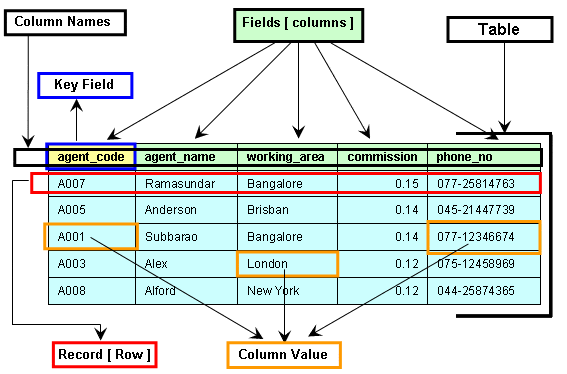

# SQL

#### Data types

|                     |                                   |
| ------------------- | --------------------------------- |
| Text / Alphanumeric | "Bob"                             |
| Character           | 'B'                               |
| Boolean             | `TRUE` `FALSE` <br> or `Yes` `No` |
| Integer             | 42                                |
| Real                | 3.142                             |
| Date/time[^1]       |                                   |

[^1]: 'Date/time' is one word

#### Comparison operators

|      |                          |
| ---- | ------------------------ |
| `=`  | equal to                 |
| `<`  | less than                |
| `<=` | less than or equal to    |
| `>`  | greater than             |
| `>=` | greater than or equal to |
| `<>` | not equal to             |

#### Boolean operators

`AND` &emsp; `OR`

#### Primary key

> Unique identifier

<br>



## `SELECT ... FROM`

```
SELECT <field>
FROM <table>;

SELECT <field1>, <field2>, ...
FROM <table>;
```

### `WHERE`

```
SELECT <field>
FROM <table>
WHERE <condition>;
```

### `ORDERBY`

|        |            |
| ------ | ---------- |
| `ASC`  | ascending  |
| `DESC` | descending |

```
SELECT <field>
FROM <table>
ORDERBY <order>;

SELECT <field>
FROM <table>
WHERE <condition>
ORDERBY <order>;
```

## `SUM`

```
SUM(<field>)
```

## `COUNT`

```
COUNT(<field>)
```
