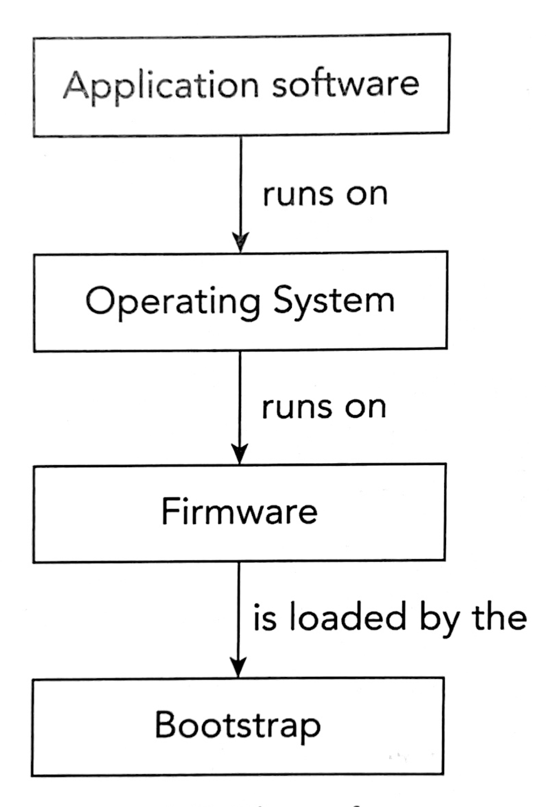

# Software

 

 

# System Software

> Services that the computer requires

- OS[^OS]
- Utility programs

## OS

| Function                                               | Description                                                                                                                                              |
| ------------------------------------------------------ | -------------------------------------------------------------------------------------------------------------------------------------------------------- |
| Providing an interface                                 | <ul><li>GUI[^GUI]<ul><li>Windows, icons, menus and pointers (WIMP)</li></ul></li><li>Command line interface</li><li>Natural language interface</li></ul> |
| Managing files                                         | <ul><li>Create, delete, move, copy, rename files/folders</li></ul>                                                                                       |
| Managing memory                                        | <ul><li>Make sure processes have enough memory allocated</li><li>Prevent two processes from accessing same memory location</li></ul>                     |
| Managing multitasking                                  | <ul><li>Decide<ul><li>which process should be executed next</li><li>how long they can execute before switching</li></ul></li></ul>                       |
| Managing interrupts                                    | <ul><li>Decides which interrupt to run</li></ul>                                                                                                         |
| Managing peripherals[^peripheral] and drivers[^driver] | <ul><li>Install drivers</li></ul>                                                                                                                        |
| Providing a platform for applications                  | <ul><li>Fetch application software instructions and execute</li></ul>                                                                                    |
| Managing user accounts                                 | <ul><li>Username & password</li><li>Preferences</li><li>Restrict access / keep data separate</li></ul>                                                   |
| Providing a security system                            |

## Interrupts

> Signal to processor

1. Each FDE cycle, processor checks interrupt queue (IH[^IH]) for higher priority interrupt
2. Stores current process
3. Checks source of interrupt
4. Calls ISR[^ISR]
5. When finished, stored process returned to memory
6. Repeat

#### Types of interrupts

- **Software**
    - Division by 0
    - Two processes attempting to access same memory location
    - Input requested
    - Output required
    - Data required from memory
- **Hardware**
    - Data input \
      (Keypress, mouse click)
    - Error from hardware \
      (Printer out of paper)
    - Hardware failure
    - New hardware device connected
    - Hard drive signal that it has read data

 

# Application Software

> Services that the user requires

- Word processor / spreadsheet
- Database
- Web browser

 

[^OS]: Operating system
[^GUI]: Graphical User Interface
[^peripheral]: External hardware device for input/output
[^driver]: Software that translates data from computer to peripheral
[^IH]: Interrupt Handler - organises interrupts based on priorities
[^ISR]: Interrupt Service Routine - program that handles the interrupt by performing instructions
