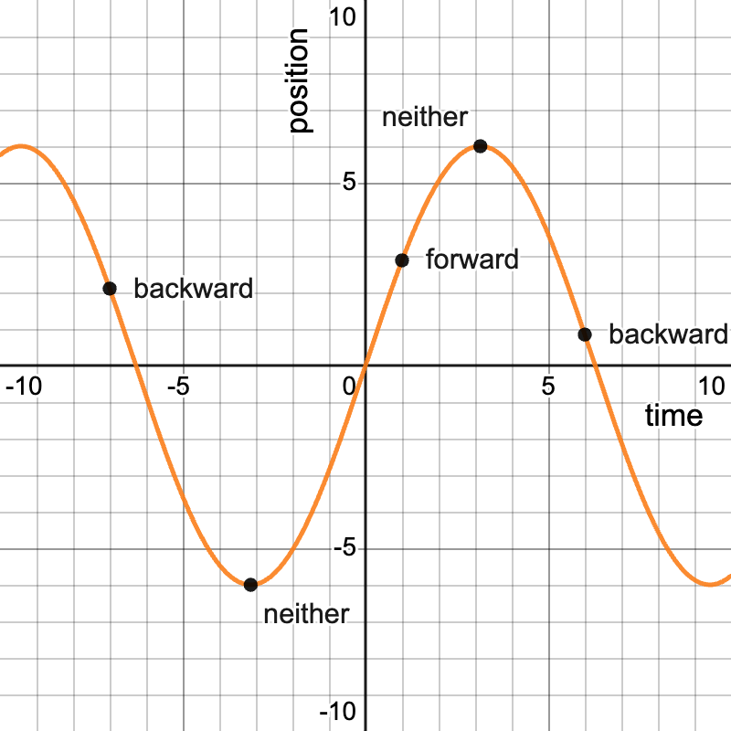
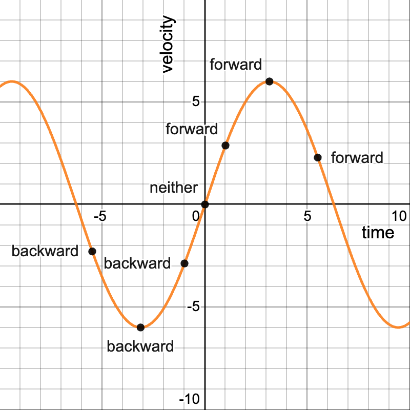
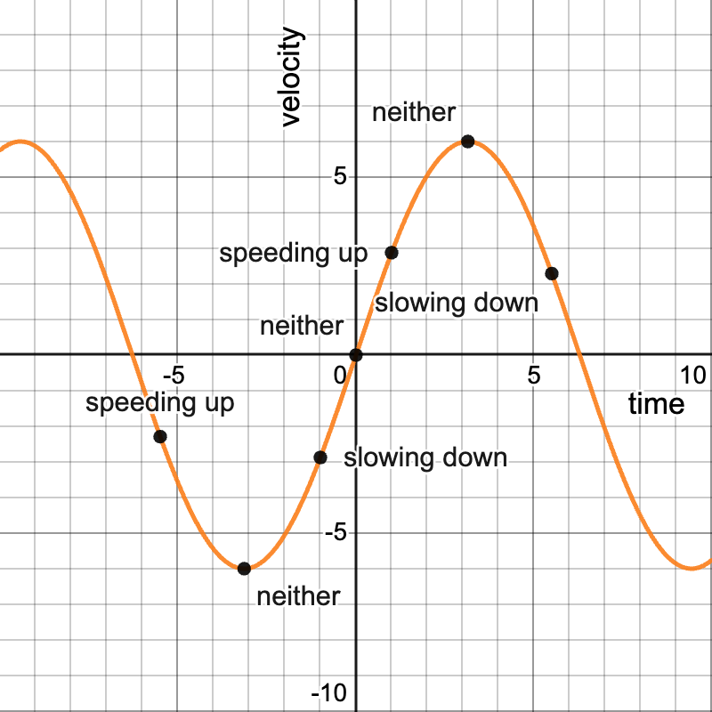

# Applied Differentiation

`calculus`

## Motion

### Direction

Velocity + = forward \
Velocity - = backward \
Velocity 0 = neither (stationary)

#### Position-time graph

#### Velocity-time graph

### Speed

Velocity +, acceleration + = speeding up \
Velocity -, acceleration - = speeding up \
Velocity +, acceleration - = slowing down \
Velocity -, acceleration + = slowing down \
Velocity 0 = neither, speed 0 (changing direction) \
Acceleration 0 = neither (changing from speeding up to slowing down and vice versa)

#### Velocity-time graph

