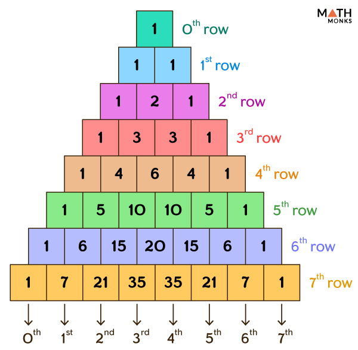

# Binomial Expansion

## Combinations

$$
\boxed{\Large(x+y)^n = \Large\sum^n_{k=0} \begin{pmatrix} n \\ k \end{pmatrix} x^ky^{n-k}}
$$

 

$$
\begin{align*}
  (x+y)^0 &= \begin{pmatrix} 0 \\ 0 \end{pmatrix} \\
  (x+y)^1 &= \begin{pmatrix} 1 \\ 0 \end{pmatrix}x + \begin{pmatrix} 1 \\ 1 \end{pmatrix}y \\
  (x+y)^2 &= \begin{pmatrix} 2 \\ 0 \end{pmatrix}x^2 + \begin{pmatrix} 2 \\ 1 \end{pmatrix}xy + \begin{pmatrix} 2 \\ 2 \end{pmatrix}y \\
  (x+y)^3 &= \begin{pmatrix} 3 \\ 0 \end{pmatrix}x^3 + \begin{pmatrix} 3 \\ 1 \end{pmatrix}x^2y + \begin{pmatrix} 3 \\ 2 \end{pmatrix}xy^2 + \begin{pmatrix} 3 \\ 3 \end{pmatrix}y^3 \\
  (x+y)^4 &= \begin{pmatrix} 4 \\ 0 \end{pmatrix}x^4 + \begin{pmatrix} 4 \\ 1 \end{pmatrix}x^3y + \begin{pmatrix} 4 \\ 2 \end{pmatrix}x^2y^2 + \begin{pmatrix} 4 \\ 3 \end{pmatrix}xy^3 + \begin{pmatrix} 4 \\ 4 \end{pmatrix}y^4
\end{align*}
$$

## Pascal's triangle

$$
\begin{align*}
  (x+y)^0 &= 1 \\
  (x+y)^1 &= x+y \\
  (x+y)^2 &= x^2+2xy+y^2 \\
  (x+y)^3 &= x^3+3x^2y+3xy^2+y^3 \\
  (x+y)^4 &= x^4+4x^3y+6x^2y^2+6xy^3+y^4
\end{align*}
$$

## Proofs

-   Combinations \
    [Khan Academy](https://youtu.be/_hrN4rVCOfI)
-   Pascal's Triangle \
    [Khan Academy](https://youtu.be/x-N76NrMDNE)
