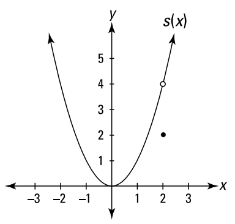
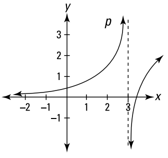
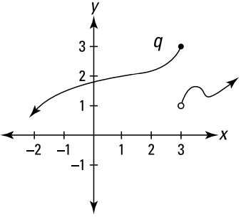

# Continuity

`calculus`

## Definition

### At a point

$f(x)$ is continuous at point $x=a$ if and only if

$$f(a) = \lim_{x\rightarrow a}f(x)$$

### Over an open interval $(a,b)$

$f(x)$ is continuous at every point in the interval

### Over a closed interval $[a,b]$

$f(x)$ is continuous at every point in the interval

and

$$\lim_{x\rightarrow a^+} = f(a)$$

and

$$\lim_{x\rightarrow b^-} = f(b)$$

## Types of discontinuity

-   Removable discontinuity (hole) \
    
    

-   Infinite discontinuity \
    

-   Jump discontinuity \
    

## Intermediate value theorem

If

-   function $f$ is **continuous** between the interval $[a,b]$
-   $L$ is **between $f(a)$ and $f(b)$**

Then

-   there is a value $c$ **between $a$ and $b$ where $f(c)=L$**
