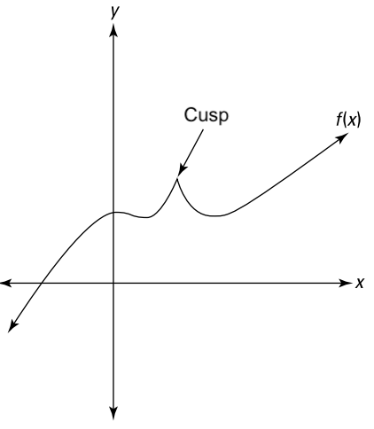
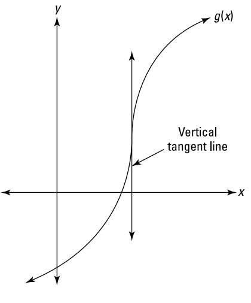
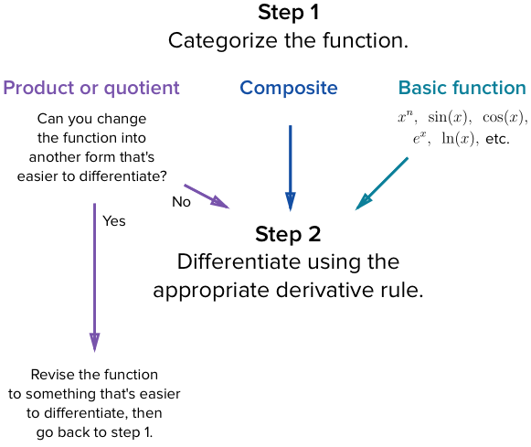

# Differentiation

`calculus`

### Definition of a derivative

- Slope of the tangent line at a particular point
- Instantaneous rate of change at a particular point

Difference quotient definition

$$\frac{dy}{dx} = f'(x) = \lim_{h\rightarrow0}\frac{f(x+h)-f(x)}{h}$$

A derivative fails to exist:

- At a discontinuity (see [Continuity](./continuity.md#definition))
- At a cusp (sharp corner) \
  
- At a vertical tangent line \
  

## Finding Derivatives

### Rules

- Constant rule
  $$\frac{d}{dx}[k] = 0$$
- Constant multiple rule
  $$\frac{d}{dx}[k \cdot f(x)] = k \cdot f'(x)$$
- Sum & difference rule
  $$\frac{d}{dx}[f(x) + g(x)] = f'(x) + g'(x)$$
- Power rule
  $$\frac{d}{dx}[x^n] = nx^{n-1}$$
- Product rule
  $$\frac{d}{dx}[f(x) \cdot g(x)] = f'(x)\cdot g(x) + g'(x)\cdot f(x)$$
- Quotient rule
  $$\frac{d}{dx}\left[\frac{f(x)}{g(x)}\right] = \frac{f'(x)\cdot g(x) - g'(x)\cdot f(x)}{g(x)^2}$$
- Chain rule
  $$\frac{d}{dx}[f(g(x))] = f'(g(x)) \cdot g'(x)$$
- Inverse function rule
  $$\frac{d}{dx}[f^{-1}(x)] = \frac{1}{f'(f^{-1}(x))}$$

### Properties

- Exponential functions
  $$
  \begin{align*}
    \frac{d}{dx}[e^x] &= e^x \\
    \frac{d}{dx}[a^x] &= a^x \cdot \ln(a)
  \end{align*}
  $$

- Logarithmic functions
  $$
  \begin{align*}
    \frac{d}{dx}[\ln x] &= \frac{1}{x} \\
    \frac{d}{dx}[\log_a x] &= \frac{1}{x \cdot \ln a}
  \end{align*}
  $$

- Trigonometric functions
  $$
  \begin{align*}
    \frac{d}{dx}[\sin x] &= \cos x \\
    \frac{d}{dx}[\cos x] &= -\sin x \\
    \frac{d}{dx}[\tan x] &= \sec^2x &= \frac{1}{\cos^2x} \\
    \frac{d}{dx}[\sec x] &= \sec x \cdot \tan x &= \frac{\sin x}{\cos^2x} \\
    \frac{d}{dx}[\csc x] &= -\csc x \cdot \cot x &= -\frac{\cos x}{\sin^2x} \\
    \frac{d}{dx}[\cot x] &= -\csc^2x &= -\frac{1}{\sin^2x}
  \end{align*}
  $$

- Inverse trigonometric functions
  $$
  \begin{align*}
    \frac{d}{dx}[\sin^{-1} x] &= \frac{1}{\sqrt{1 - x^2}} \\
    \frac{d}{dx}[\cos^{-1} x] &= -\frac{1}{\sqrt{1 - x^2}} \\
    \frac{d}{dx}[\tan^{-1} x] &= -\frac{1}{1 + x^2} \\
  \end{align*}
  $$
  $$$$
  $$$$

### Implicit Differentiation

- Differentiate both sides of equation with respect to x.
- If expression does not contain x (contains y), use the chain rule:
  $$
  \begin{align*}
    \frac{d}{dx}[y^4] &= \frac{d}{dy}[y^4] \cdot \frac{dy}{dx} \\
    &= 4y^3 \cdot \frac{dy}{dx}
  \end{align*}
  $$
- Solve for dy/dx.

## Proofs

- Product rule \
  [Khan Academy](https://youtu.be/L5ErlC0COxI) \
  [3B1B](https://youtu.be/YG15m2VwSjA?t=253)

- Chain rule \
  [Khan Academy](https://youtu.be/0T0QrHO56qg)

- Inverse functions \
  [Khan Academy](https://youtu.be/XOs9vVmzE70)

- Exponential functions
  (see [Euler's Number](./eulers-number.md)) \
  [Khan Academy (1)](https://youtu.be/W_gNAjWWvBg) \
  [Khan Academy (2)](https://youtu.be/gHzLHknEk1M) \
  [3B1B](https://youtu.be/m2MIpDrF7Es)

- Logarithmic functions \
  [Khan Academy](https://youtu.be/Qm1TDobNrns)

- Trigonometric functions \
  [3B1B](https://youtu.be/S0_qX4VJhMQ?t=756) \
  [Khan Academy (sin)](https://youtu.be/HVvCbnrUxek) \
  [Khan Academy (cos)](https://youtu.be/PszFmdiMUcs) \
  [Khan Academy (tan & cot)](https://youtu.be/Rr_1GQyiRYs) \
  [Khan Academy (csc & sec)](https://youtu.be/TDJ5nXWEkWM)

- Inverse trigonometric functions \
  [Khan Academy (sin-1)](https://youtu.be/yIQUhXa-n-M) \
  [Khan Academy (cos-1)](https://youtu.be/v_OfFmMRvOc) \
  [Khan Academy (tan-1)](https://youtu.be/G7WyEp8gHs0)
