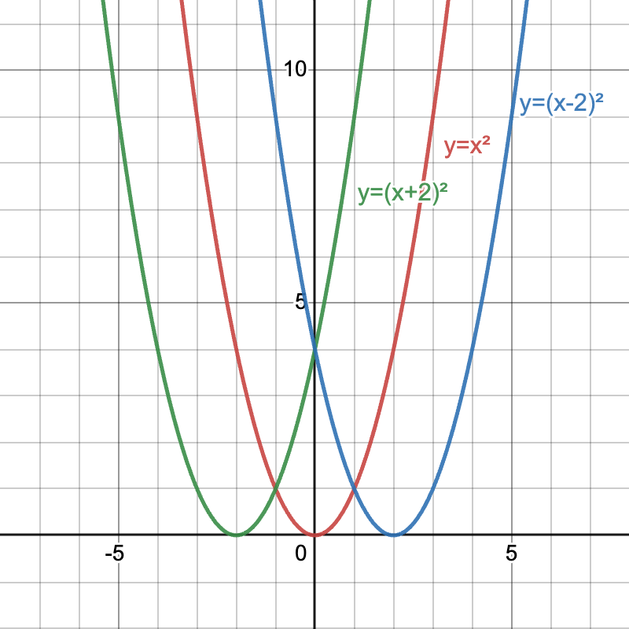
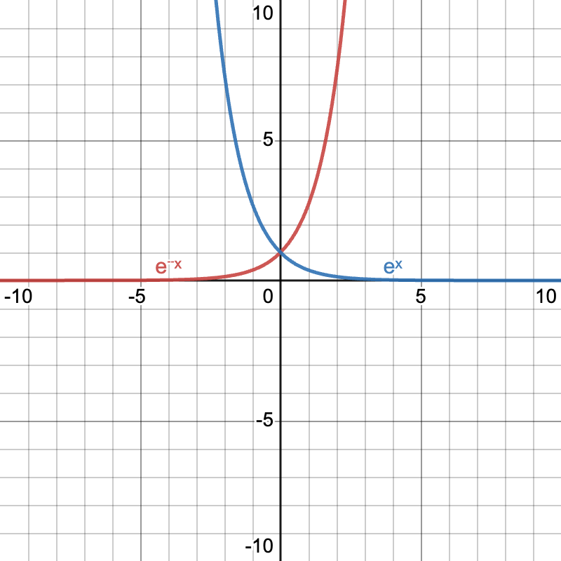
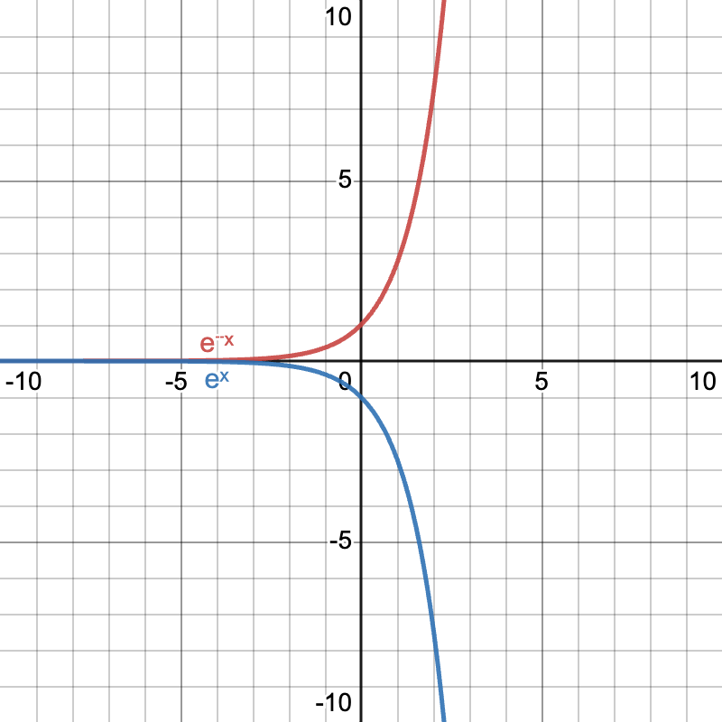

# Graph Transformations

## Translation

| $x+$ : Left   $x-$ : Right                          | $y+$ : Down   $y-$ : Up                           |
| ------------------------------------------------------ | ---------------------------------------------------- |
|  |  |

## Reflection

| $-x$ : Horizontal (y-axis)                                         | $-y$ : Vertical (x-axis)                                           |
| ------------------------------------------------------------------ | ------------------------------------------------------------------ |
|  |  |
