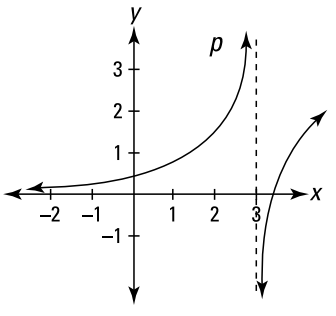
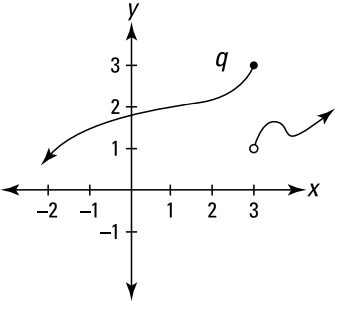
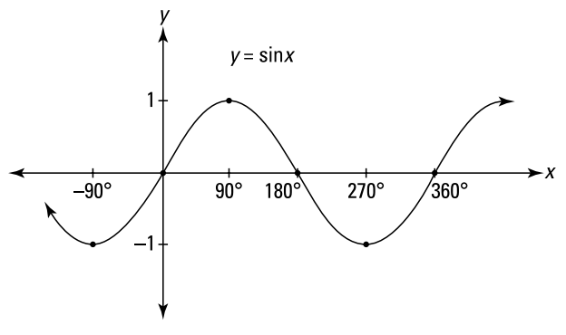
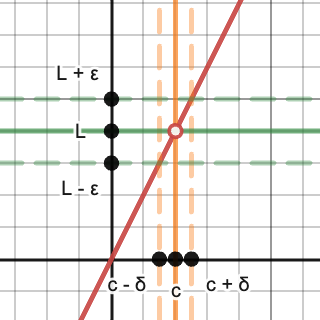
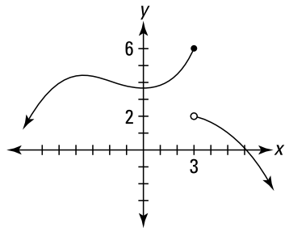
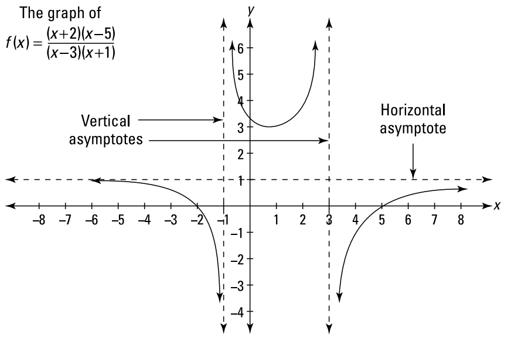
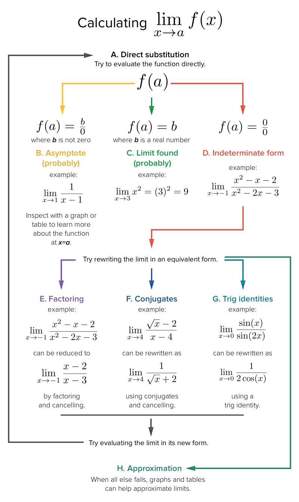
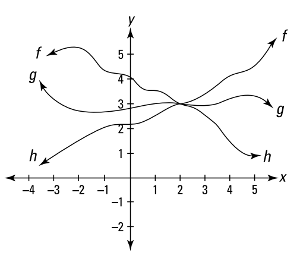

# Limits

`calculus`

## Definition

> $\displaystyle\lim_{x\rightarrow c}f(x)$ exists iff
> $$
\lim_{x\rightarrow c^-}f(x) = \lim_{x\rightarrow c^+}f(x)
> $$

### A limit fails to exist

|                                                                          |                                                              |
| ------------------------------------------------------------------------ | ------------------------------------------------------------ |
| At an infinite discontinuity (vertical asymptote)                        |  |
| At a jump discontinuity                                                  |          |
| With $\displaystyle\lim_{x\rightarrow\infty}$ of an oscillating function |         |

### Epsilon-delta definition

Whenever a point $x$ is within $\delta$ units of $c$, $f(x)$ is within $\epsilon$ units of $L$. \

## One-sided limits

$$
\begin{align*}
  \lim_{x\rightarrow3^-}f(x) &= 6 \quad \scriptsize\text{(From the left -)} \\
  \lim_{x\rightarrow3^+}f(x) &= 2 \quad \scriptsize\text{(From the right +)}
\end{align*}
$$

## Asymptotes

Vertical asymptotes
$$
\begin{align*}
  \lim_{x\rightarrow3^-}f(x) &= \infty \\
  \lim_{x\rightarrow3^+}f(x) &= -\infty
\end{align*}
$$

Horizontal asymptotes
$$
\begin{align*}
  \lim_{x\rightarrow\infty}f(x) &= 1 \\
  \lim_{x\rightarrow-\infty}f(x) &= 1
\end{align*}
$$

# **Solving Limits**

## Properties

- Constant rule
$$\lim_{x\rightarrow c}a = a$$

- Sum & difference rule
$$
\begin{align*}
  \lim_{x\rightarrow c}[f(x)+g(x)] &= \lim_{x\rightarrow c}f(x) + \lim_{x\rightarrow c}g(x) \\
  \lim_{x\rightarrow c}[f(x)-g(x)] &= \lim_{x\rightarrow c}f(x) - \lim_{x\rightarrow c}g(x)
\end{align*}
$$

- Product & quotient rule
$$
\begin{align*}
  \lim_{x\rightarrow c}[f(x)\cdot g(x)] &= \lim_{x\rightarrow c}f(x) \cdot \lim_{x\rightarrow c}g(x) \\
  \lim_{x\rightarrow c}\left[\frac{f(x)}{g(x)}\right] &= \frac{\displaystyle\lim_{x\rightarrow c}f(x)}{\displaystyle\lim_{x\rightarrow c}g(x)}
\end{align*}
$$

- Constant multiple rule
$$\lim_{x\rightarrow c}[k\cdot f(x)] = k\cdot\lim_{x\rightarrow c}f(x)$$

- Power & root rule
$$
\begin{align*}
  \lim_{x\rightarrow c}~[f(x)]^n &= \left[\lim_{x\rightarrow c}f(x)\right]^n \\
  \lim_{x\rightarrow c}\sqrt[n]{f(x)} &= \sqrt[n]{\lim_{x\rightarrow c}f(x)}
\end{align*}
$$

- Composite rule
$$\lim_{x\rightarrow c}f(g(x)) = f\left(\lim_{x\rightarrow c}g(x)\right)$$

## Important Limits

$$
\begin{align*}
  \lim_{x\rightarrow 0^+}\frac{1}{x} &= \infty \\
  \lim_{x\rightarrow 0^-}\frac{1}{x} &= -\infty \\
  \lim_{x\rightarrow \infty}\frac{1}{x} &= 0 \\
  \lim_{x\rightarrow -\infty}\frac{1}{x} &= 0 \\
  \\
  \lim_{x\rightarrow 0}\frac{\sin x}{x} &= \lim_{x\rightarrow 0}\frac{x}{\sin x} &= 1 \\
  \lim_{x\rightarrow 0}\frac{\cos x-1}{x} &= \lim_{x\rightarrow 0}\frac{1-\cos x}{x} &= 1 \\
  \lim_{x\rightarrow \infty}\left(1+\frac{1}{x}\right)^x &= e \approx 2.718
\end{align*}
$$

## Limits at infinity $\scriptsize(\lim_{x\rightarrow\infty})$

Limit of

#### Polynomial / Constant

$\infty$ or $-\infty$

#### Rational functions

Multiply numerator and denominator by 1 / highest power of x and simplify

Shortcut:

- $\text{degree of numerator} > \text{degree of denominator}$
    - No horizontal asymptote
    - Limit = $\infty$ or $-\infty$
- $\text{degree of numerator} < \text{degree of denominator}$
    - $\displaystyle\lim_{x\rightarrow\infty}f(x) = \lim_{x\rightarrow-\infty}f(x) = 0$
- $\text{degree of numerator} = \text{degree of denominator}$
    - $$\lim_{x\rightarrow\infty}f(x) = \lim_{x\rightarrow-\infty}f(x) = \frac{\small\text{coefficient of highest power of x in denominator}}{\small\text{coefficient of highest power of x in numerator}}$$
    - If the highest power is odd, for $\infty$ the limit is positive, for $-\infty$ the limit is negative
    - If the highest power is even, the limit is always positive

#### sin x / x

$$\lim_{x\rightarrow\infty}\frac{\sin x}{x} = \lim_{x\rightarrow-\infty}\frac{\sin x}{x} = 0$$

## Sandwich Theorem

If
$$f(x) \leq g(x) \leq h(x)$$

and
$$\lim_{x\rightarrow c}f(x) = \lim_{x\rightarrow c}h(x) = L$$

then
$$\lim_{x\rightarrow c}g(x) = L$$

## L'Hôpital's Rule

If
$$\frac{f(x)}{g(x)} = \frac{0}{0} \enspace\text{or}\enspace \frac{\infty}{\infty} \enspace\text{or } -\frac{\infty}{\infty}$$

then
$$\lim_{x\rightarrow c}\frac{f(x)}{g(x)}=\lim_{x\rightarrow c}\frac{f'(x)}{g'(x)}$$

## Proofs

- Epsilon-delta definition of limits \
  [Khan Academy (1)](https://youtu.be/w70af5Ou70M) \
  [Khan Academy (2)](https://youtu.be/0sCttufU-jQ) \
  [3B1B](https://youtu.be/kfF40MiS7zA?t=292)

- $\lim_{x\rightarrow\infty}(\frac{\sin x}{x})$ \
  [The Organic Chemistry Tutor](https://youtu.be/sjLFl7Z8W_I?t=220) \
  [NancyPi](https://youtu.be/nViVR1rImUE)

- L'Hôpital's Rule $(\frac{0}{0})$ \
  [3B1B](https://youtu.be/SIB4WDYF5DQ)
