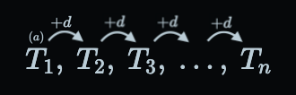
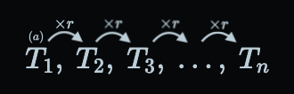

# Progressions and Series

Progression → pattern of numbers \
Series → sum of a pattern of numbers

## Arithmetic

> **Addition (+)** \
>  \
> d = common difference

### Progression

$$T_n = a+d(n-1)$$

### Series

$$
\begin{align*}
  S_n &= n\left(\frac{T_0+T_n}{2}\right) \\
  &= n\left(\frac{2a+d(n-1)}{2}\right)
\end{align*}
$$

### Average (mean)

$$\mathrm{ave} = \frac{T_a+T_b}{2}$$

## Geometric

> **Multiplication (x)** \
>  \
> r = common ratio

### Progression

$$T_n = ar^{n-1}$$

### Series

$$S_n = \frac{a(1-r^n)}{1-r}$$

### Infinite series

$$S_\infty = \frac{a}{1-r};~~-1<r<1$$

### Average

$$\mathrm{ave} = \pm\sqrt{T_a\cdot T_b}$$

## Proofs

-   Arithmetic series \
    [Khan Academy](https://youtu.be/Uy_L8tnihDM)
-   Geometric series \
    [Khan academy](https://youtu.be/Cf0-6ngH2gs)
-   Infinite geometric series \
    $\displaystyle S_\infty = \lim_{n\rightarrow\infty}\frac{a(1-r^n)}{1-r};~~-1<r<1$
