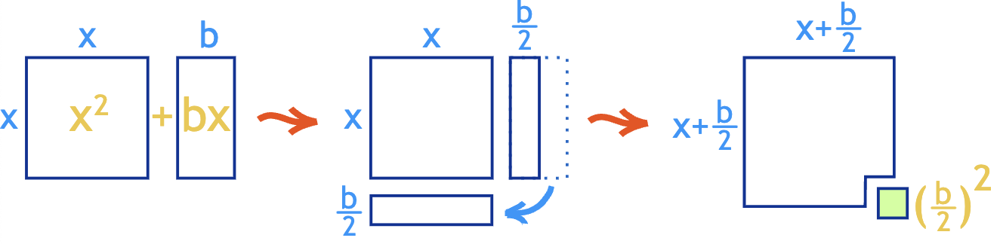

# Quadratic Equations

## Quadratic formula

$$
\begin{aligned}
  ax^2+bx+c &= 0 \\
  x &= \frac{-b\pm\sqrt{b^2-4ac}}{2a}
\end{aligned}
$$

## Discriminant

$$d = b^2-4ac$$

- $d = \text{perfect square}$
    - the expression can be factorised
- $d > 0$
    - 2 answers
- $d = 0$
    - 1 answer
- $d < 0$
    - 0 answers

## Factorisation

### Completing the square

$$
\begin{aligned}
  x^2+bx+c &= x^2+bx+\left(\frac{b}{2}\right)^2-\left(\frac{b}{2}\right)^2+c \\
  &= \left(x-\frac{b}{2}\right)^2-\left(\frac{b}{2}\right)^2+c
\end{aligned}
$$

$$
\begin{aligned}
  ax^2+bx+c &= a\left(x^2+\frac{bx}{a}\right)+c \\
  &= a\left[x^2+\frac{bx}{a}+\left(\frac{b}{2a}\right)^2-\left(\frac{b}{2a}\right)^2\right] + c \\
  &= a\left[\left(x-\frac{b}{2a}\right)^2-\left(\frac{b}{2a}\right)^2\right] + c \\
  &= a\left(x-\frac{b}{2a}\right)^2-a\left(\frac{b}{2a}\right)^2+c
\end{aligned}
$$

