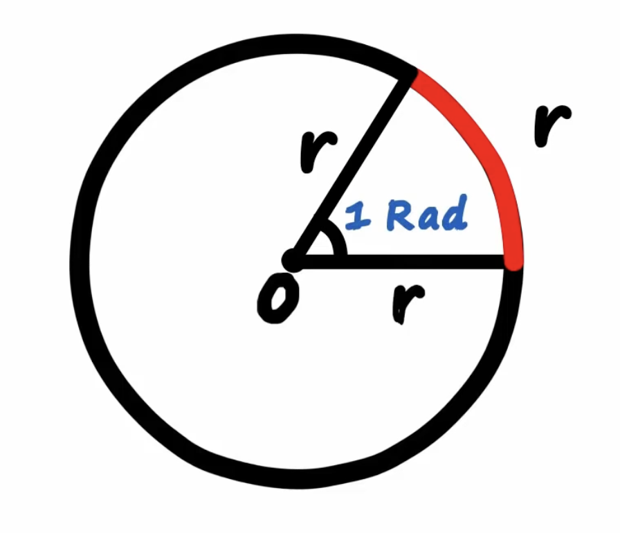
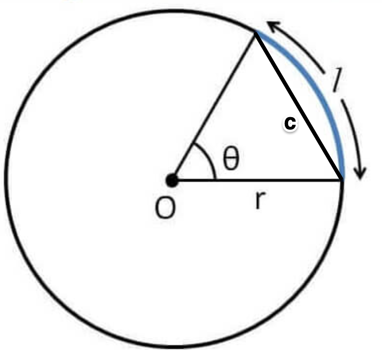

# Radian Measure

## Intuition

$\textrm{Circumference} = 2\pi r$ \
$360\degree = 2\pi r\textrm{ rad}$

## Memorisation

| Degrees      | Radians                      |
| ------------ | ---------------------------- |
| $360\degree$ | $\displaystyle2\pi$          |
| $180\degree$ | $\displaystyle\pi$           |
| $90\degree$  | $\displaystyle\frac{\pi}{2}$ |
| $60\degree$  | $\displaystyle\frac{\pi}{3}$ |
| $45\degree$  | $\displaystyle\frac{\pi}{4}$ |
| $30\degree$  | $\displaystyle\frac{\pi}{6}$ |

## Formulae

$$
\begin{align*}
  \mathrm{length~of~arc} &= r\theta \\
  \mathrm{area~of~sector} &= \frac{1}{2}r^2\theta \\
  \mathrm{length~of~chord} &= 2r\sin\frac{\theta}{2} \\
  \mathrm{area~of~triangle} &= \frac{1}{2}r^2\sin\theta \\
  \mathrm{area~of~segment} &= \frac{1}{2}r^2\theta - \frac{1}{2}r^2\sin\theta
\end{align*}
$$
