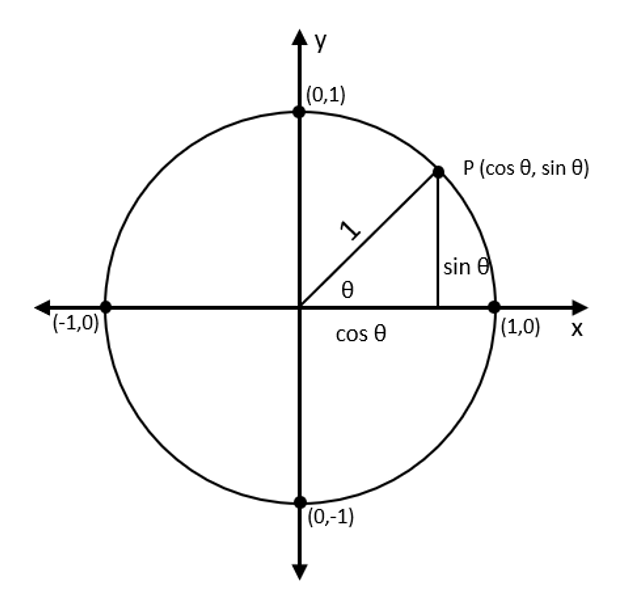

# Trigonometric Ratios

### Normal

- $\sin\theta = \frac{O}{H}$
- $\cos\theta = \frac{A}{H}$
- $\tan\theta = \frac{O}{A}$

### Reciprocal

- $\csc\theta = \frac{1}{\sin\theta} = \frac{H}{O}$
- $\sec\theta = \frac{1}{\cos\theta} = \frac{H}{A}$
- $\cot\theta = \frac{1}{\tan\theta} = \frac{A}{O}$

## Periodicity relations

- $\sin\theta = \sin(\theta+2k\pi)$
- $\cos\theta = \cos(\theta+2k\pi)$
- $\tan\theta = \tan(\theta+k\pi)$
- $\csc\theta = \csc(\theta+2k\pi)$
- $\sec\theta = \sec(\theta+2k\pi)$
- $\cot\theta = \cot(\theta+k\pi)$
  
- $\sin\theta = -\sin(\theta-\pi)$
- $\cos\theta = -\cos(\theta-\pi)$
- $\tan\theta = -\tan(\theta-\frac{\pi}{2})$
- $\csc\theta = -\csc(\theta-\pi)$
- $\sec\theta = -\sec(\theta-\pi)$
- $\cot\theta = -\cot(\theta-\frac{\pi}{2})$

**A**ll **S**tudents **T**ake **C**ocaine

## Pythagorean identites

- $\sin^2\theta+\cos^2\theta=1$
- $\tan^2\theta+1=\sec^2\theta$
- $1+\cot^2\theta=\csc^2\theta$

## Double angle identities

1. $\sin(\alpha+\beta) = \sin\alpha\cos\beta+\sin\beta\cos\alpha$ \
   $\sin(\alpha-\beta) = \sin\alpha\cos\beta-\sin\beta\cos\alpha$ \
   $\sin2\theta = 2\sin\theta\cos\theta$
2. $\cos(\alpha+\beta) = \cos\alpha\cos\beta - \sin\alpha\sin\beta$ \
   $\cos(\alpha-\beta) = \cos\alpha\cos\beta + \sin\alpha\sin\beta$ \
   $\cos2\theta = \cos^2\theta - \sin^2\theta$
3. $\tan(\alpha+\beta) = \frac{\tan\alpha+\tan\beta}{1-\tan\alpha\tan\beta}$ \
   $\tan(\alpha-\beta) = \frac{\tan\alpha-\tan\beta}{1+\tan\alpha\tan\beta}$ \
   $\tan2\theta = \frac{2\tan\theta}{1-\tan^2\theta}$

## Quotient identities

- $\tan\theta = \frac{\sin\theta}{\cos\theta}$
- $\cot\theta = \frac{\cos\theta}{\sin\theta}$

## Scalene triangle

### Law of cosines

$$c^2 = a^2+b^2-2ab\cos\gamma$$

### Area of triangle

$$A = \frac{1}{3}ab\sin\gamma$$

### Sine rule

$$\frac{\sin c}{\gamma} = \frac{\sin a}{\theta}$$

## Graphs

https://www.desmos.com/calculator/w8aphz7kkk

## Unit circle

## Memorisation

<table>
    <tbody>
        <tr style="background: darkslategrey;">
            <td>Degrees</td>
            <td>0˚</td>
            <td>30˚</td>
            <td>45˚</td>
            <td>60˚</td>
            <td>90˚</td>
        </tr>
        <tr style="background: darkslategrey;">
            <td>Radians</td>
            <td>0</td>
            <td>π/6</td>
            <td>π/4</td>
            <td>π/3</td>
            <td>π/2</td>
        </tr>
        <tr>
            <td style="background: darkslategrey">sin</td>
            <td>0</td>
            <td>1/2</td>
            <td>1/√2</td>
            <td>√3/2</td>
            <td>1</td>
        </tr>
        <tr>
            <td style="background: darkslategrey;">cos</td>
            <td>1</td>
            <td>√3/2</td>
            <td>1/√2</td>
            <td>1/2</td>
            <td>0</td>
        </tr>
        <tr>
            <td style="background: darkslategrey;">tan</td>
            <td>0</td>
            <td>1/√3</td>
            <td>1</td>
            <td>√3</td>
            <td>∞</td>
        </tr>
    </tbody>
</table>

### Memorisation trick

- $\sin0\degree = \sqrt{\frac{0}{4}}$
- $\sin30\degree = \sqrt{\frac{1}{4}}$
- $\sin45\degree = \sqrt{\frac{2}{4}}$
- $\sin60\degree = \sqrt{\frac{3}{4}}$
- $\sin90\degree = \sqrt{\frac{4}{4}}$

## Proofs

- Pythagorean identities \
  [Steve Stein](https://youtu.be/l4aov-PXp_w)
- Compound angle identities
  - $\sin(a+b)$ \
    [Eddie Woo](https://youtu.be/zpyPTBgUqkQ)
  - $\sin(a-b)$ \
    [Eddie Woo](https://youtu.be/vnc6vleQQlw)
  - $\cos$ and $\tan$
    [Eddie Woo](https://youtu.be/Af7Jyrzxfy4)
- Quotient identities \
  see [Unit circle](#unit-circle)
