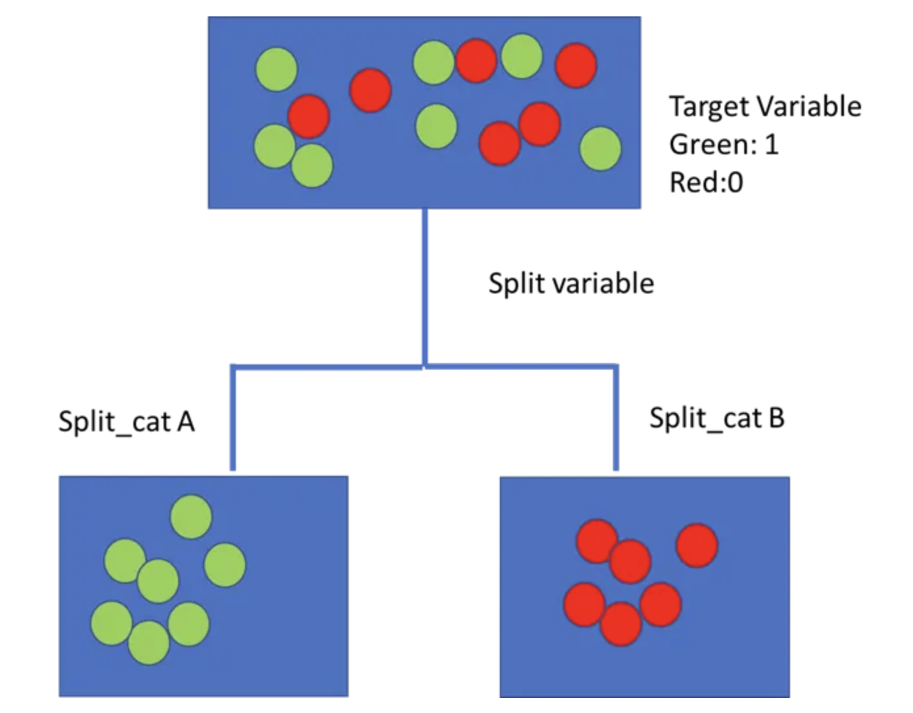

# Decision Trees

`supervised learning`

Use bins for continuous values.

Use pruning to avoid overfitting.

# **Algorithms**

## ID3

Top\-down learning algorithm

1. Calculate entropy \(information gain\) of each attribute. \(see [Entropy](evernote:///view/242323586/s493/0483a0a3-a04f-f912-6d83-96c4a63f8394/4832b1e7-0b72-559e-6f07-8fc67a7b209f)\)
2. Select atttribute with highest entropy.
3. Split data based on the selected attribute
4. Repeat process recursively until all instances of the same class are grouped together \(no entropy\), or when there are no more attributes.
5. Assign the most frequent class label to the leaf node.
