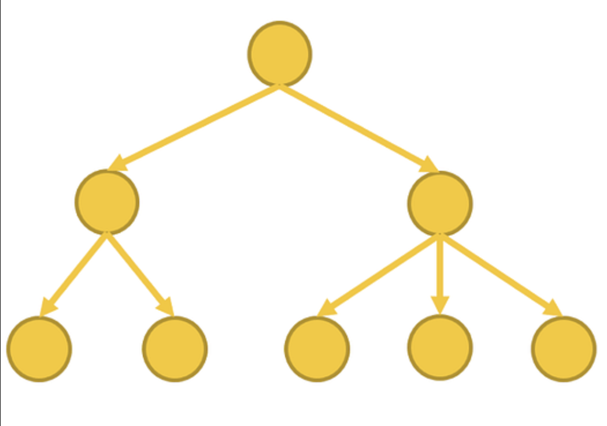
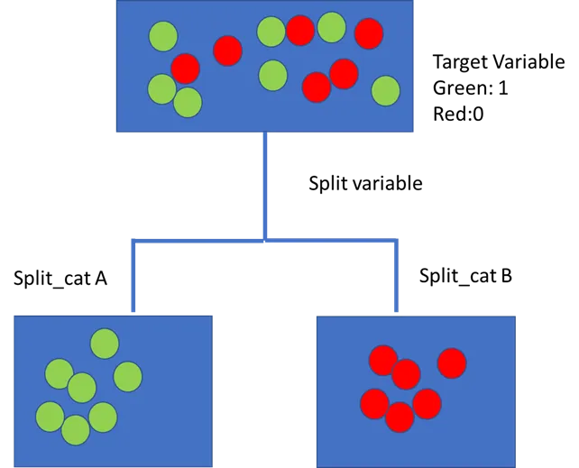

# Ensemble Learning

Combines the predictions of multiple individual models \(known as base learners\) to make more accurate predictions.

## Bagging

Multiple learning algorithms are applied onto randomly sampled data \(with replacement\). Each base learner makes its own prediction, then the final prediction is obtained by taking the average of all predictions \(regression\) or by voting \(classification\).

## Boosting

An iterative process where base learners are trained sequentially. Each base learner focuses on the mistakes made by its predecessors and tries to correct them. The final prediction of the ensemble is obtained by weighted voting, with more weight given to the more accurate base learners.

### Pros

- Won't overfit

### Algorithm

1. 𝔻t\(i\) = the distribution of how "hard" a particular data point is at timestep t
    ht\(xi\) = the prediction of the base learner at timestep t for feature xi
    yi = the actual label of feature xi
    εt = the error of the base learner at timestep t
    αt = the weight of a base learner at timestep t \(how much a base learner contributes to the final prediction\)
    Zt = "whatever normalisation constant for timestep t in order to make it all work out to be a distribution"
    Given training data \(xi, yi\), where y ∈ {\-1, 1}.
2. Initialise 𝔻1\(i\) to be 1/n for all data points.
3. 
    Where
    
    Update 𝔻t\(i\) with the following formula.
4. Find a weak classifier ht\(x\) where the error εt is the smallest.
5. Repeat steps 3 and 4 until convergence, increment t for each iteration.
6. 
    Output hfinal\(x\).
