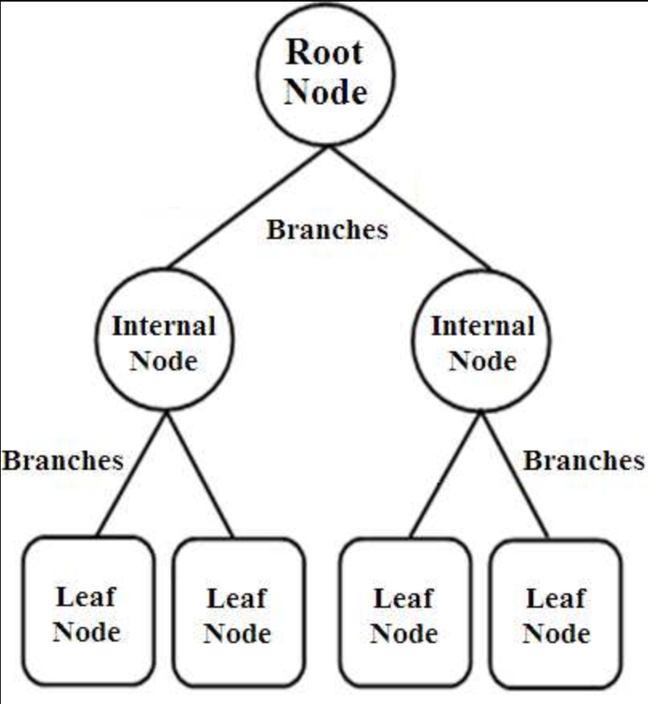

# Perceptron

A unit in an artificial neural network that has an input, weights, a bias and an activation function.

### Activation

## Perceptron learning algorithm

1. Initialise weights and bias randomly.
2. Pass input forward through the perceptron.
3. weight \+= learning_rate \* \(actual_y \- predicted_y\) \* input
   Update weights using the formula:
4. Repeat until convergence.
