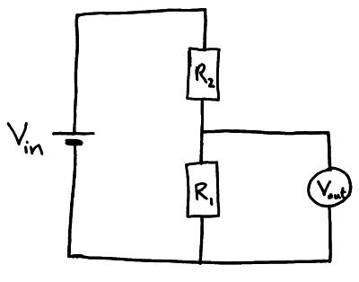

# Circuits

`electricity`

## Series

#### Current same

$A=A_1=A_2=\dots=A_n$

#### Voltage added

$V=V_1+V_2+\dots+V_n$

#### Resistance added

$R=R_1+R_2+\dots+R_n$

## Parallel

#### Current added

$A=A_1+A_2+\dots+A_n$

#### Voltage same

$V=V_1=V_2=\dots=V_n$

#### Resistance added inverse

$\displaystyle \frac{1}{R}=\frac{1}{R_1}+\frac{1}{R_2}+\dots+\frac{1}{R_n}$

$\displaystyle R=\frac{R_1\cdot R_2}{R_1+R_2}$

## Potential divider

Delivers only a proportion of voltage from a battery

> $$
\begin{aligned}
  \frac{V_{\text{in}}}{R_\text{total}} &= \frac{V_{\text{out}}}{R_\text{out}} \\
  \frac{V_{\text{in}}}{R_1+R_2} &= \frac{V_{\text{out}}}{R_1} \\
  \\
  R_1 &\propto V_{\text{out}} \\
  R_2 &\propto \frac{1}{V_{\text{out}}}
\end{aligned}
> $$
