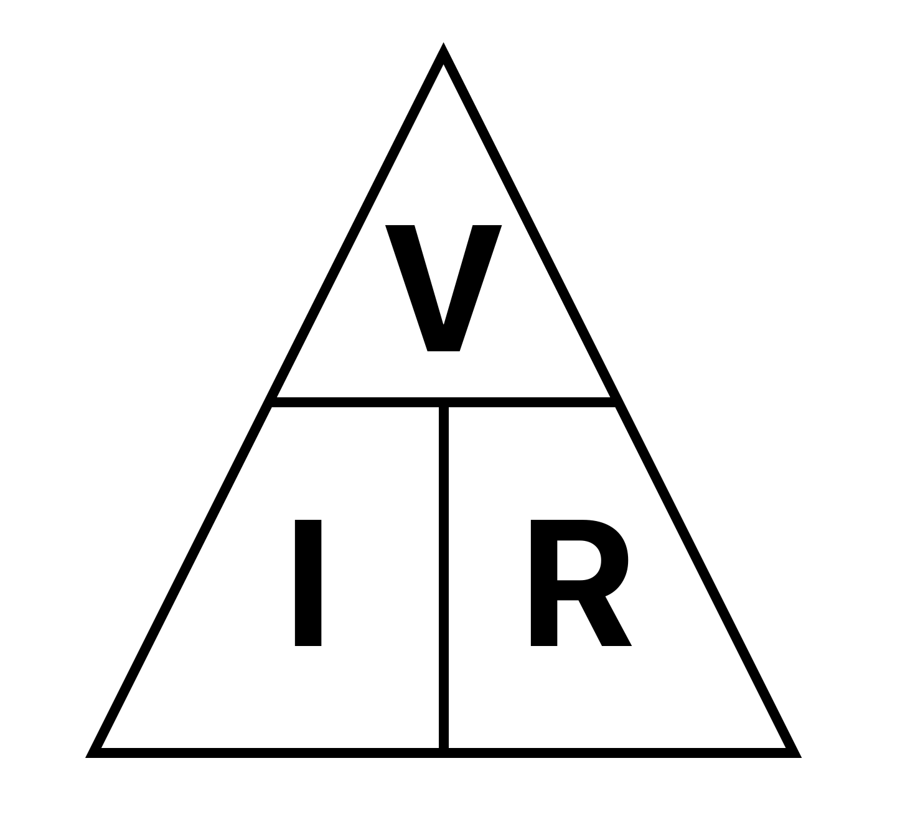

# Current, Voltage and Resistance

`electricity`

## Current

> $$
> \begin{align*}
>   I &= \frac{Q}{t} \\
>   \mathrm{current} &= \mathrm{\frac{charge}{time}}
> \end{align*}
> $$
>
> Unit: Amp (A) \
> The rate of electron flow at a point (coulombs per second)

## Voltage

> $$
> \begin{align*}
>   V &= \frac{E}{Q} \\
>   \mathrm{voltage} &= \mathrm{\frac{energy}{charge}}
> \end{align*}
> $$
>
> Unit: Volt (V) \
> Work done per charge

### p.d.

Work done to push 1C of charge \
through an <u>electrical component</u>

### e.m.f.

Work done to push 1C of charge \
through the <u>whole circuit</u>

## Resistance

> Unit: Ohm (Ω) \
> Opposition to current flow in an electrical circuit

### Factors affecting resistance

$$
\begin{align*}
  \mathrm{length} &\propto \mathrm{resistance} \\
  \mathrm{cross~sectional~area} &\propto \mathrm{\frac{1}{resistance}} \\
  \mathrm{diameter} &\propto \mathrm{\frac{1}{resistance^2}} \\
  \mathrm{radius} &\propto \mathrm{\frac{1}{resistance^2}} \\
  \mathrm{temperature} &\propto \mathrm{resistance} \text{ \scriptsize(conductors)} \\
  \mathrm{temperature} &\propto \mathrm{\frac{1}{resistance}} \text{ \scriptsize(semiconductors)} \\
  \mathrm{material}
\end{align*}
$$

### Resistivity of material

Because $\mathrm{resistance} \propto \mathrm{\frac{length}{area}}$:

> $$
> \begin{align*}
>   R &= \rho \cdot \frac{l}{A} \\
>   \mathrm{resistance} &= \mathrm{resistivity \cdot \frac{length}{area}}
> \end{align*}
> $$
>
> Wires of the same material have the same resistivity ($\rho$)

## Ohm's Law

> $$
> \begin{align*}
>   V &= IR \\
>   \mathrm{voltage} &= \mathrm{current \cdot resistance}
> \end{align*}
> $$

$$
\begin{align*}
  \mathrm{voltage} &\propto \mathrm{current} \\
  \mathrm{voltage} &\propto \mathrm{resistance} \\
  \mathrm{current} &\propto \frac{1}{\mathrm{resistance}}
\end{align*}
$$

