# Electrical Components

| Component                                            | Symbol                                                                                                     |
| ---------------------------------------------------- | ---------------------------------------------------------------------------------------------------------- |
| Cell                                                 | 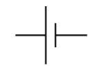                                                                         |
| Battery                                              | 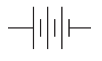 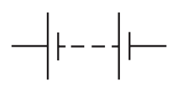 |
| Ground/earth                                         | 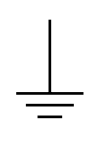                                                               |
| Power supply                                         | 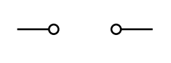                                                         |
| DC power supply                                      | 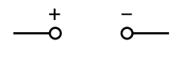                                                   |
| AC power supply                                      | 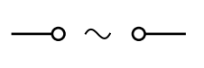                                                   |
| Switch                                               | 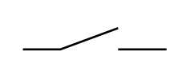                                                                     |
| Junction                                             | 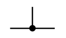                                                                 |
| [Lamp](#current-voltage-graphs)                      | 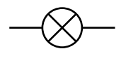                                                                         |
| Ammeter                                              | 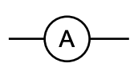                                                                   |
| Voltmeter                                            | 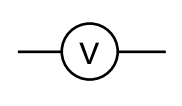                                                               |
| Generator                                            | 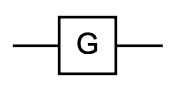                                                               |
| Motor                                                | 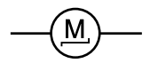                                                                       |
| [Diode](#current-voltage-graphs)                     | 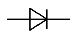                                                                       |
| Light-emitting diode (LED)                           | 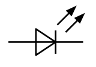                                   |
| Fuse                                                 | 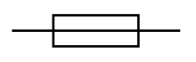                                                                         |
| [Fixed resistor](#current-voltage-graphs)            | 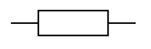                                                     |
| Variable resistor                                    | 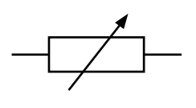                                               |
| [Thermistor](#thermistor)                            | 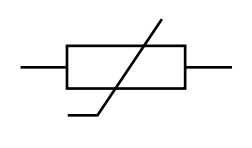                                                             |
| [Light-dependent resistor (LDR)](#ldr)               | 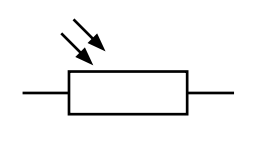                           |
| [Potential divider](./circuits.md#potential-divider) | 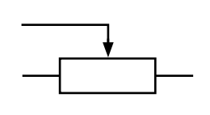                                               |
| Transformer                                          | 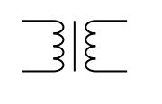                                                           |
| Relay coil                                           | 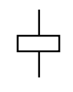                                                             |
| Magnetising coil                                     | 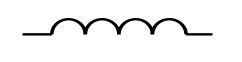                                                 |
| Electric bell                                        | 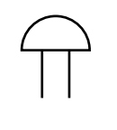                                                       |
| Heater                                               | 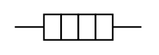                                                                     |

## Resistors

### Thermistor

$\displaystyle \mathrm{temperature} \propto \mathrm{\frac{1}{resistance}} \text{ \scriptsize(semiconductors)}$

### LDR

$\displaystyle \mathrm{luminous~intensity} \propto \mathrm{\frac{1}{resistance}}$

## Current-voltage graphs

|   Component    |                                       Graph                                       |
| :------------: | :-------------------------------------------------------------------------------: |
| Fixed resistor | 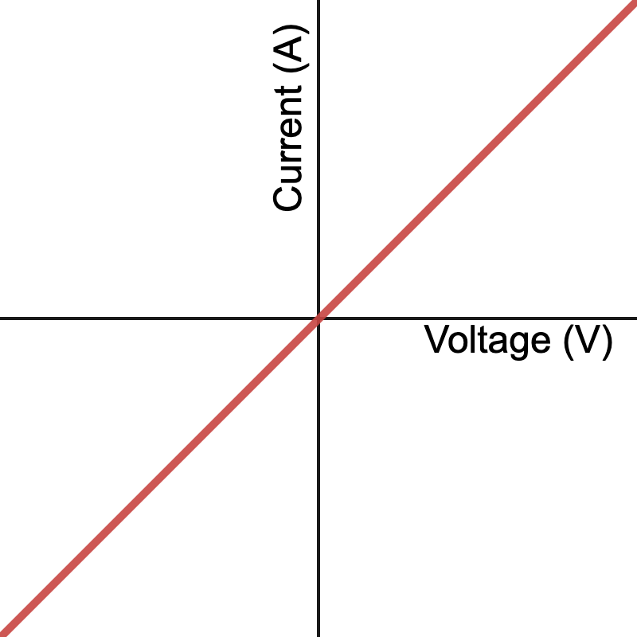 |
|      Lamp      |     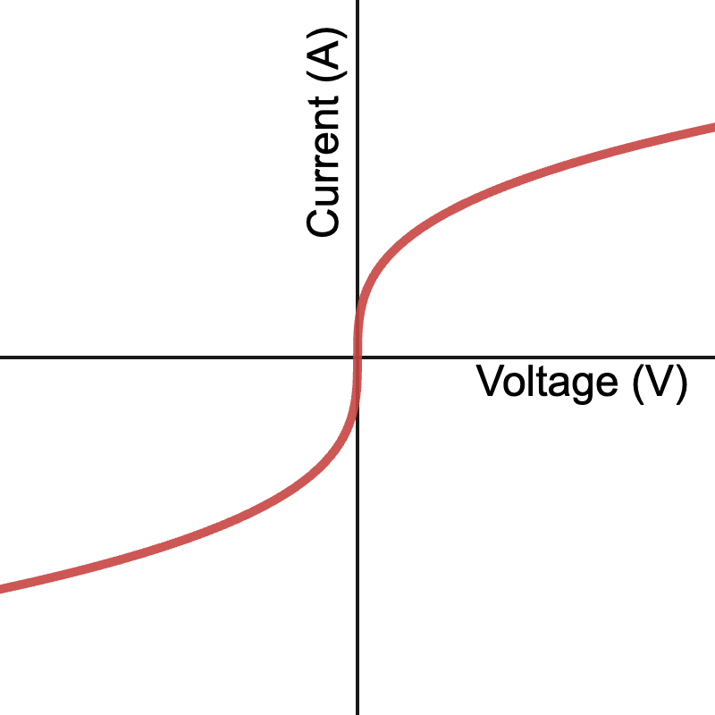     |
|     Diode      |    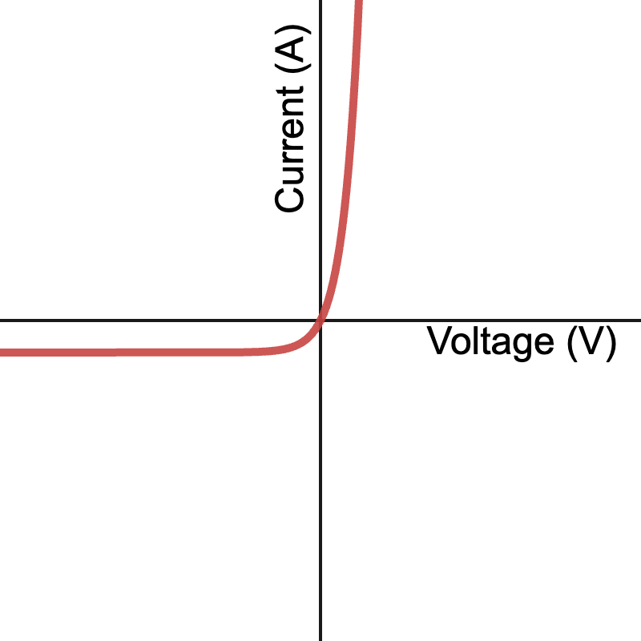    |

## Rectifier

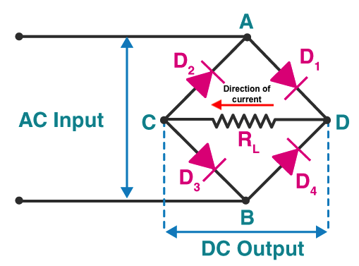
