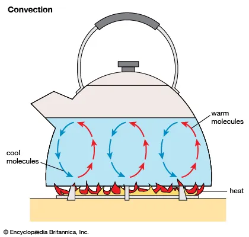

# Heat Transfer

> From high temperature → low temperature

## Conduction

**Heat transfer in solids and liquids** \
Molecules collide, transfer <u>heat</u> energy

|                         | Molecules vibrate in fixed position   (collide with <u>neighbouring</u> atoms) | Electrons move freely |
| ----------------------- | --------------------------------------------------------------------------------- | --------------------- |
| Metals                  | ✅                                                                                | ✅                    |
| <nobr>Non-metals</nobr> | ✅                                                                                | ❌                    |

## Convection

**Heat transfer in fluids** (liquid & gas)

### Convection current

1. Cool water is heated at the bottom
2. Hot water rises
3. Cool water sinks
4. Cool water is heated at the bottom
5. Circulation

### Sea breeze and land breeze

Land - less specific heat capacity

Sea breeze

-   Daytime
-   Lands heats up more quickly than the sea
-   Warm air from the land rises
-   Displaced by cooler air from the sea

Land breeze

-   Nighttime
-   Land cools off more quickly than the sea
-   Warm air from the sea rises
-   Displaced by cooler air from the land

## Radiation

**Heat transfer without a medium** (via infrared rays)

$$
\begin{align*}
  \mathrm{energy~radiated} &\propto \mathrm{surface~area} \\
  \mathrm{energy~radiated} &\propto \mathrm{temperature}
\end{align*}
$$

| Dark & dull           | White & shiny        |
| --------------------- | -------------------- |
| Good absorber/emitter | Bad absorber/emitter |
|                       | Good reflector       |
