# Lenses

| Keywords  |                     |
| --------- | ------------------- |
| Real      | Virtual             |
| Upright   | Inverted            |
| Same size | Enlarged/Diminished |

## Convex lenses

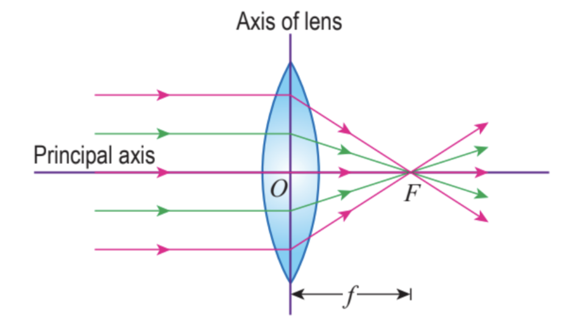

### Standard rays

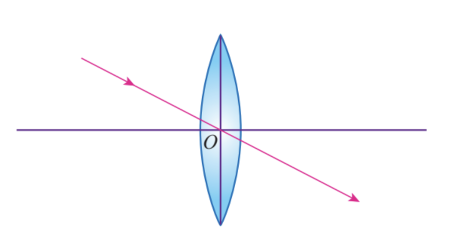
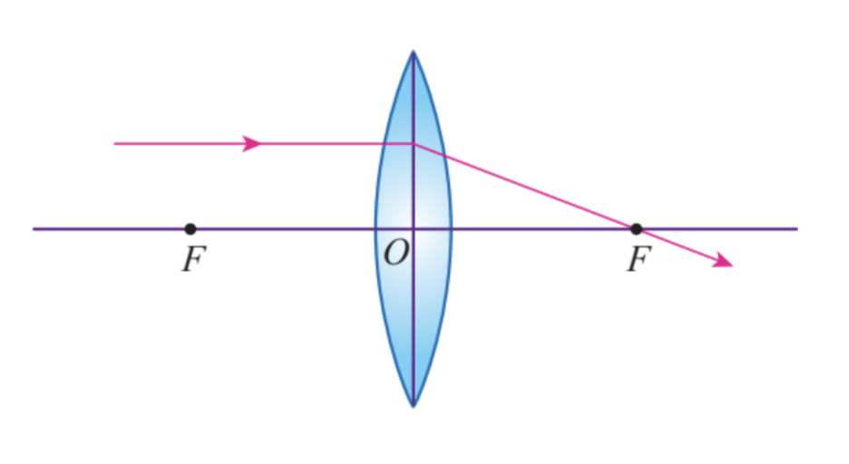
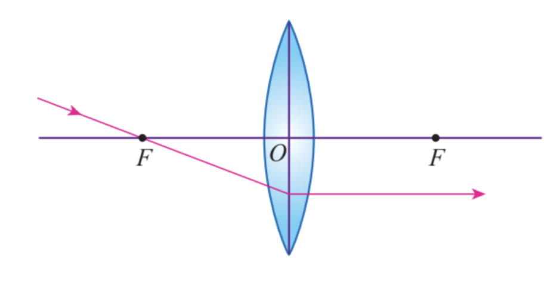

### Forming images

#### Real image

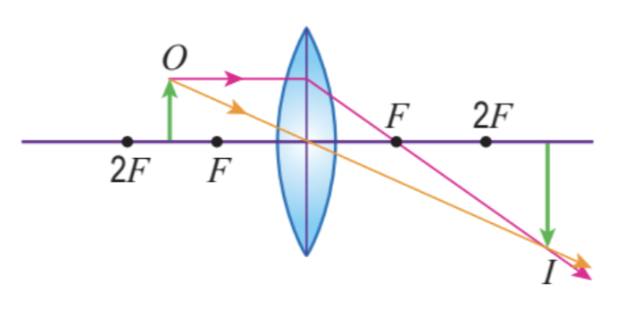

#### Virtual image

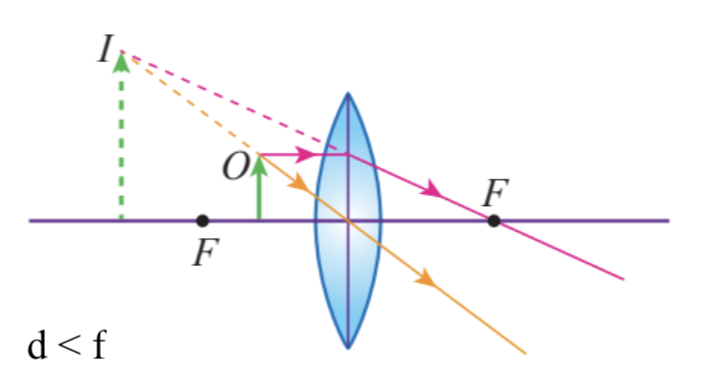

## Concave lenses

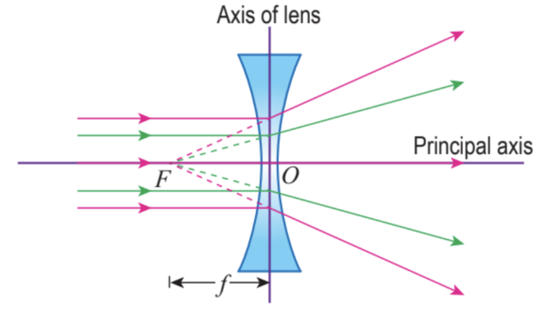

### Standard rays

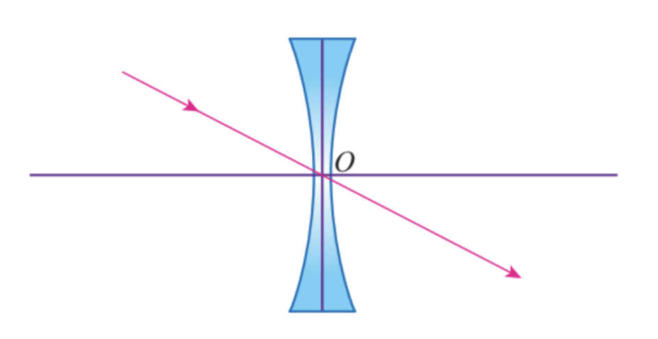
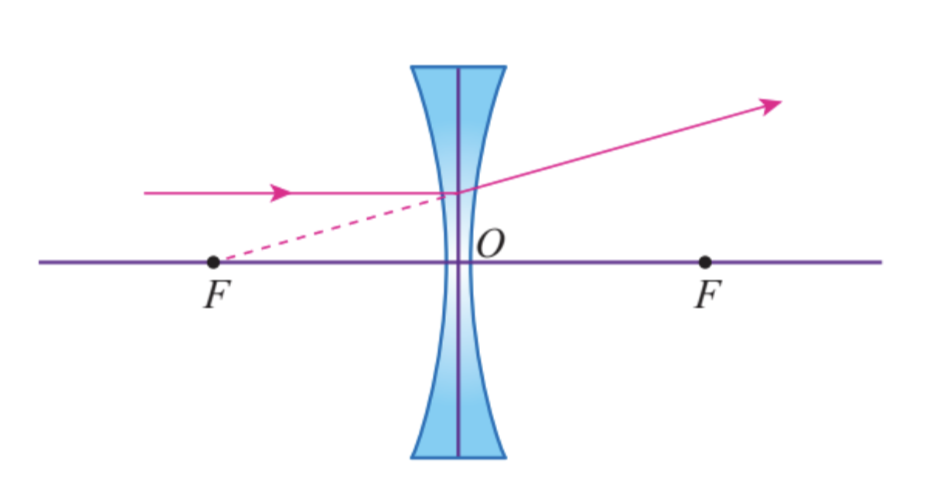
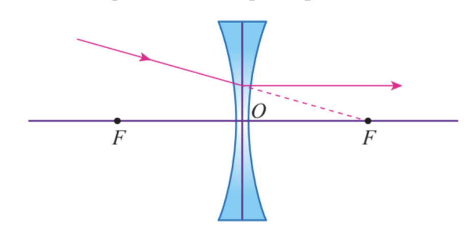

### Forming images

#### Virtual image

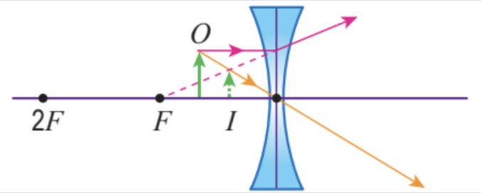
