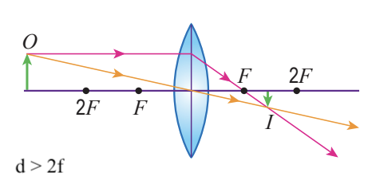
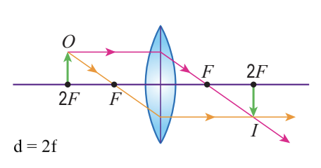
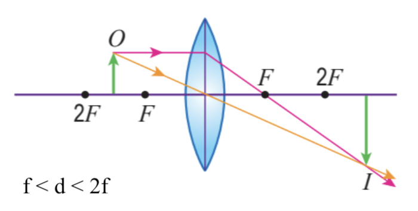

# Lenses

| Keywords  |                     |
| --------- | ------------------- |
| Real      | Virtual             |
| Upright   | Inverted            |
| Same size | Enlarged/Diminished |

## Convex lenses

### Standard rays

|                                                                                              |                                                                                                  |
| -------------------------------------------------------------------------------------------- | ------------------------------------------------------------------------------------------------ |
|  |                                                                                                  |
|                 |  |

### Forming images

|                                                                                                     | Properties                             |
| --------------------------------------------------------------------------------------------------- | -------------------------------------- |
|  | **Real**   Inverted   Diminished |
|    | **Real**   Inverted   Same size  |
|      | **Real**   Inverted   Enlarged   |
|          | **Virtual**   Upright   Enlarged |

## Concave lenses

### Standard rays

|                                                                                                |                                                                                                          |
| ---------------------------------------------------------------------------------------------- | -------------------------------------------------------------------------------------------------------- |
|  |                                                                                                          |
|                 |  |

### Forming images

|                                                                         | Properties                               |
| ----------------------------------------------------------------------- | ---------------------------------------- |
|  | **Virtual**   Upright   Diminished |
