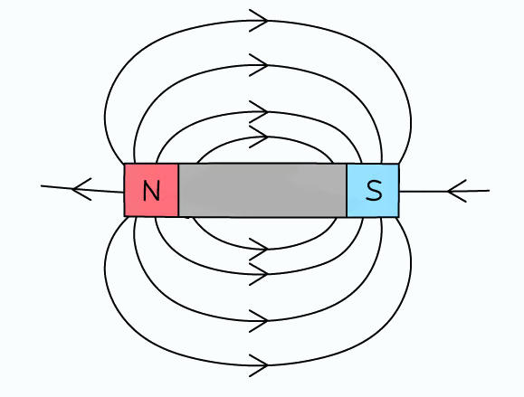
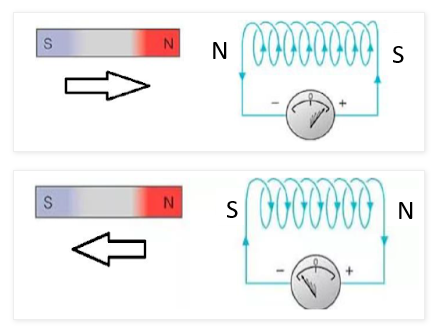
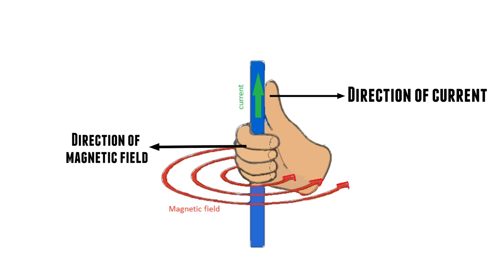
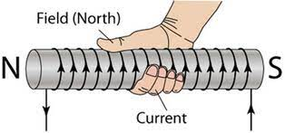
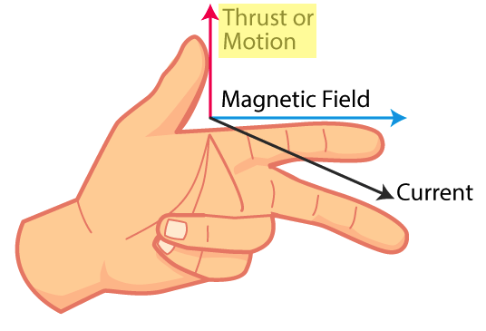
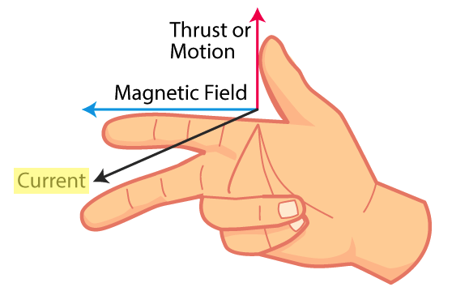
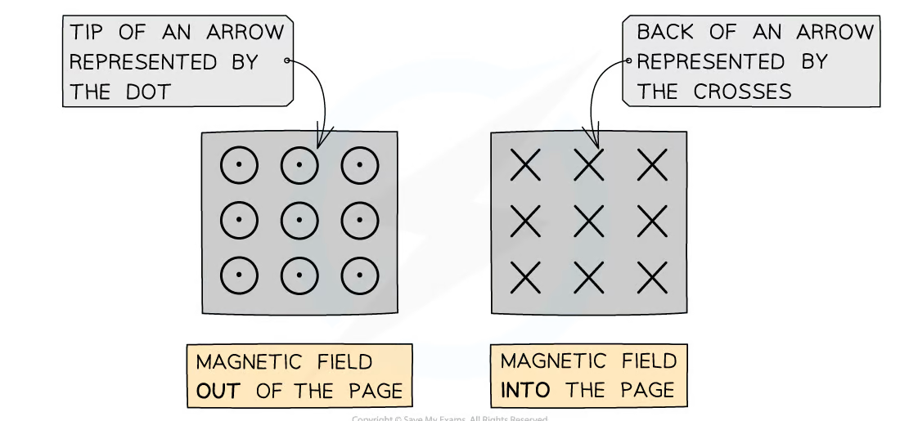

# Magnetic Fields

-   **Region where magnetic pole experiences force**
-   N → S (direction of force on N pole)
-   Closer field lines = stronger field

## Magnetic fields of wires

> Wires produce weak magnetic field \
> (see [Right hand grip rule](#right-hand-grip-rule))

### Solenoid

> Coils of wires \
> Amplifies magnetic field \
> (see [Right hand grip rule](#right-hand-grip-rule))

To increase strength of electromagnet:

-   Increase current
-   Increase number of turns (coil)
-   Increase size of core

## <u>Exerted</u> force on wire

> When electrons are in magnetic field, force is exerted \
> Induced magnetic field of wire **interacts** with permanent magnetic field of magnet \
> (see [Fleming's left hand rule](#flemings-left-hand-rule))

To increase force on wire:

-   Increase current (electromagnet)
-   Increase number of turns (coil)
-   Stronger magnet
-   Increase length of wire within magnetic field

To reverse force on wire:

-   Reverse current
-   Reverse poles of magnet

## <u>Induced</u> current in wire

> When wire **cuts through magnetic field** \
> e.m.f. is induced, which causes current \
> (see [Fleming's right hand rule](#flemings-right-hand-rule))
>
> #### Faraday's law
>
> $$\text{e.m.f. induced in conductor} \propto \text{magnetic field line cutting rate}$$
>
> #### Lenz's law
>
> Induced current always flows in direction that opposes change

To increase induced current:

-   Stronger magnet
-   Increase movement speed
-   Increase length of wire within magnetic field

To reverse induced current:

-   Movement in opposite direction
-   Reverse poles of magnet

### Solenoid

> Poles oppose change \
> Coil produce repulsion force \
> (see [Lenz's law](#lenzs-law))

### Eddy current \*

> Created when metals cut through magnetic fields lines \
> Produces motion that opposes change

 

# Applications

## Electromagnet

-   Laminated soft iron core
    -   **Soft** magnetic material (easily magnetised/demagnetised)

## D.C. motor

-   Split ring commutator
    -   **Reverses direction of current in coil** every half turn \
        so coil keeps rotating in one direction
-   Carbon brushes
    -   Increase contact between split ring commutator and external circuit
    -   Ensure current is maintained

## A.C. generator

-   Slip ring
-   Carbon brushes

## Transformer

> Step up: voltage ⬆ \
> Step down: voltage ⬇

-   Laminated soft iron core

$$
\begin{align*}
  \frac{V_p}{N_p} &= \frac{V_s}{N_s} \\
  \mathrm{\frac{primary~voltage}{turns~in~primary~coil}} &= \mathrm{\frac{secondary~voltage}{turns~in~secondary~coil}} \\
  \\
  V_pI_p &= V_sI_s ~ \scriptsize\text{(power is constant)} \\
  \mathrm{input~voltage \cdot input~current} &= \mathrm{output~voltage \cdot output~current}
\end{align*}
$$

## Relay

## Loudspeaker

## Alarm bell

 

# Hand rules

## Right hand grip rule

## Fleming's left hand rule

For finding direction of **force** \
Current causes force

## Fleming's right hand rule \*

For finding direction of **induced current** \
Force causes current

# Into and out of arrows

