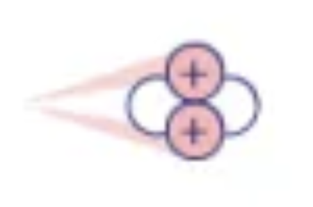
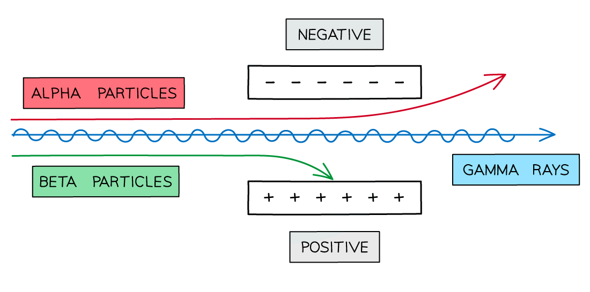
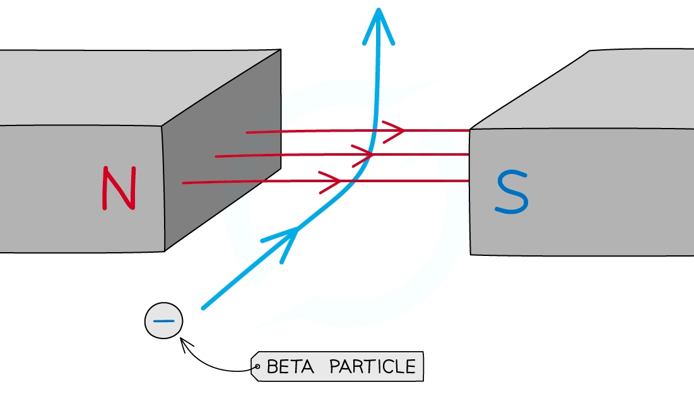

# Radiation

|                     | Alpha                                                                                              | Beta                                                                 | Gamma                                                                  |
| ------------------- | -------------------------------------------------------------------------------------------------- | -------------------------------------------------------------------- | ---------------------------------------------------------------------- |
| Particle            |    2 protons, 2 neutrons (helium nucleus) |    1 electron |    electromagnetic wave |
| Symbol              | $\mathrm{^{4}_{2}\alpha}$                                                                          | $\mathrm{^{~~~0}_{-1}\beta}$                                         | $\gamma$                                                               |
| Relative charge[^1] | +2                                                                                                 | -1                                                                   | 0                                                                      |
| Mass[^2]            | 4                                                                                                  | 1/1840                                                               | 0                                                                      |
| Ionising power      | High                                                                                               | Medium                                                               | Low                                                                    |
| Penetrating power   | Low                                                                                                | Medium                                                               | High                                                                   |
| Stopped by          | Paper                                                                                              | Aluminium <nobr>(1 cm)</nobr>                                        | Lead <nobr>(10 cm)</nobr>                                              |

## Radioactive Decay

> **Half-life** \
> Time taken for half the nuclei to decay
>
> $$
> \begin{align*}
>   N &= \frac{N_0}{2^{\frac{t}{h}}} \\
>   \mathrm{amount~of~substance} &= \mathrm{\frac{initial~amoun t}{2^{\frac{time}{\text{half-life}}}}} \\
> \end{align*}
> $$

### Alpha decay

Loses 2 proton 2 neutron

$$\ce{^{226}_{88}Ra -> ^{222}_{86}Rn + ^{4}_{2}\alpha}$$

### Beta decay

1 neutron turns into 1 proton and 1 electron, loses electron

$$\ce{^{131}_{53}I -> ^{131}_{54}Xe + ^{~0}_{-1}\beta}$$

## Deflection

### Electric field

Beta deflect more than alpha because small mass

### Magnetic field

Use [Fleming's left hand rule](./magnetic-fields.md#flemings-left-hand-rule) \
Direction of conventional current is opposite to electron flow (beta)

 

---

 

## Irradiation vs Contamination

| Irradiation                          | Contamination                         |
| ------------------------------------ | ------------------------------------- |
| Object exposed to ionising radiation | Radioactive material is inside object |

 

[^1]: Unit: Elementary charge $(e)$, equal to charge of a proton.
[^2]: Unit: Atomic mass unit $(u)$, equal to 1/12 of a carbon-12 atom.
