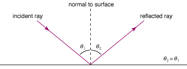
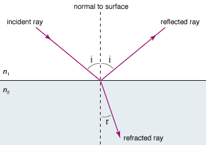

# Rays

## Reflection of rays

## Refraction of rays

### Snell's law

> $$
\begin{aligned}
  n &= \frac{c}{v} = \frac{\sin i}{\sin r} \\
  \mathrm{refractive~index} &= \mathrm{\frac{speed~of~light~in~vacuum}{speed~of~light~in~medium}} \\
  &= \mathrm{\frac{\sin(angle~of~incidence)}{\sin(angle~of~refraction)}}
\end{aligned}
> $$

see [Speed of Light](./waves.md#speed-of-waves)

### Total internal reflection

> $$
\begin{aligned}
  n &= \frac{\sin 90\degree}{\sin c} = \frac{1}{\sin c} \\
  \mathrm{refractive~index} &= \mathrm{\frac{1}{\sin(critical~angle)}}
\end{aligned}
> $$
>
> When angle of incidence > critical angle, all light is reflected (no refraction).
