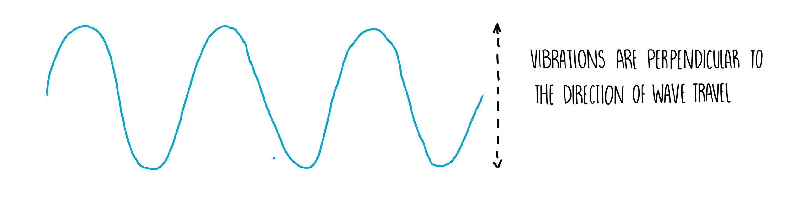
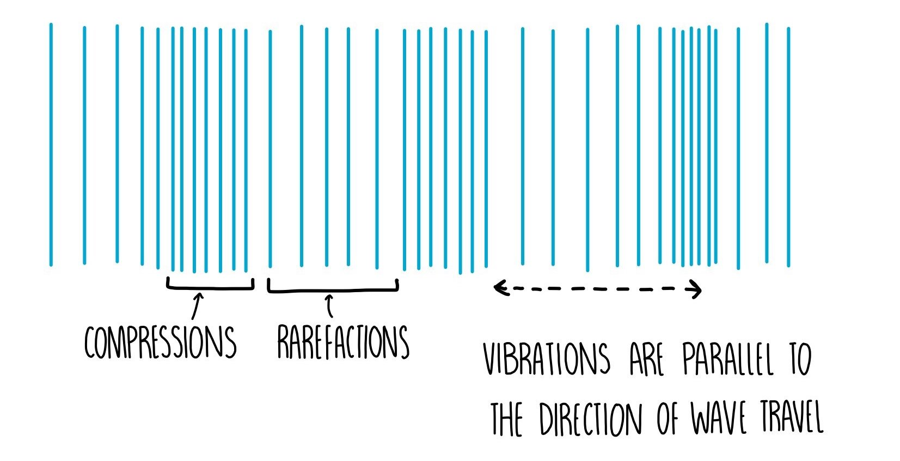
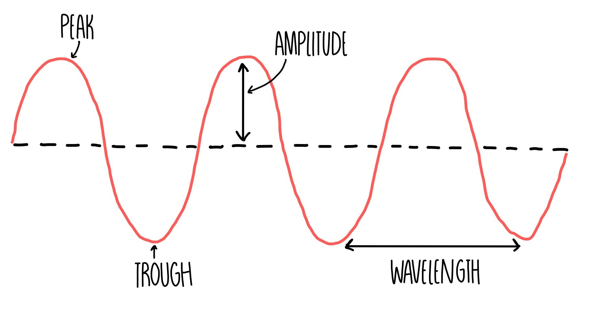
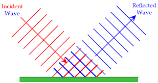
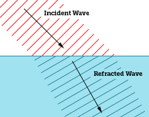
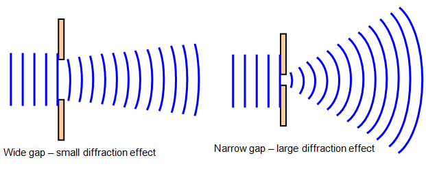

# Waves

### Transverse waves

**Oscillations <u>perpendicular</u> to direction of travel**

Examples

-   [Electromagnetic waves](#electromagnetic-waves)
-   [Water waves](#water-waves-effects)
-   S wave (seismic wave)

### Longitudinal waves

**Oscillations <u>parallel</u> to direction of travel**

Compressions - part of wave with high pressure \
Rarefactions - part of wave with low pressure

Examples

-   [Sound waves](#sound-waves)
-   P waves (seismic wave)

## Properties of waves

-   Wavelength \
    Length of one complete oscillation
-   Period \
    Time for one complete oscillation
-   Amplitude \
    Maximum distance a point moves from its rest position
-   Frequency (Hz) \
    Number of waves passing any point per second

## Wave equation

> $$
> \begin{align*}
>   v &= f\lambda \\
>   \mathrm{speed} &= \mathrm{frequency \cdot wavelength}
> \end{align*}
> $$
>
> $\small\text{speed} \propto \text{wavelength}$

## Frequency equation

> $$
> \begin{align*}
>   f &= \frac{1}{T} \\
>   \mathrm{frequency} &= \mathrm{\frac{1}{period}}
> \end{align*}
> $$

## Speed of waves

| Wave                         | Medium | Speed                   |
| ---------------------------- | ------ | ----------------------- |
| Light (Electromagnetic wave) | Vacuum | $3\cdot10^8~\text{m/s}$ |
| Sound                        | Air    | $340~\text{m/s}$        |
| Sound                        | Water  | $1500~\text{m/s}$       |

## Water waves (effects)

### Reflection

### Refraction

-   Shallower
    -   Slower
    -   Shorter wavelength
    -   Refracted towards normal
-   Deeper
    -   Faster
    -   Longer wavelength
    -   Refracted away from the normal

### Diffraction

-   More diffraction if
    -   Gap smaller
    -   Wavelength longer

## Electromagnetic waves

| **High frequency** |
| ------------------ |
| Gamma ray          |
| X-ray              |
| Ultraviolet        |
| Visible light      |
| Infrared           |
| Microwave          |
| Radio wave         |
| **Low frequency**  |

## Uses

| Wave          | Uses                                                                                                                                                                                                                 |
| ------------- | -------------------------------------------------------------------------------------------------------------------------------------------------------------------------------------------------------------------- |
| Gamma rays    | <ul><li>Detection/treatment of cancer</li><li>Sterilising food</li><li>Sterilising medical equipment</li></ul>                                                                                                       |
| X-rays        | <ul><li>Medical scanner (bones)</li><li>Security scanner (luggage)</li><li>Metal scanner (reveal flaws in metal)</li></ul>                                                                                           |
| Ultraviolet   | <ul><li>Fluorescent materials<ul><li>Bank note markings</li><li>Security marker pens</li></ul></li><li>Sterilising water</li></ul>                                                                                   |
| Visible light | <ul><li>Photography</li><li>Optical fibres</li></ul>                                                                                                                                                                 |
| Infrared      | <ul><li>Short range communication (remote controls)</li><li>Optical fibres</li><li>Thermal imaging<ul><li>Intruder alarms</li></ul></li><li>Heating<ul><li>Radiant heater</li><li>Electric grill</li></ul></li></ul> |
| Microwaves    | <ul><li>Satellite TV</li><li>WiFi</li><li>Microwave ovens</li></ul>                                                                                                                                                  |
| Radio waves   | <ul><li>Radio and TV</li><li>Bluetooth</li><li>Radio frequency identification (RFID)</li><li>Astronomy</li></ul>                                                                                                     |

## Reasons of application

| Application                                                           | Wave                                  | Reason                                                                                             |
| --------------------------------------------------------------------- | ------------------------------------- | -------------------------------------------------------------------------------------------------- |
| Optical fibres<ul><li>Cable TV</li><li>High-speed broadband</li></ul> | Visible light & infrared              | <ul><li>Transparent</li><li>Can carry high rates of data</li></ul>                                 |
| Bluetooth                                                             | Radio waves <nobr>(low energy)</nobr> | <ul><li>Can penetrate walls</li></ul>                                                              |
| WiFi                                                                  | Microwave                             | <ul><li>Can penetrate walls</li><li>Only require short aerial for transmission/reception</li></ul> |

## Harmful effects

| Wave                | Harmful effects                                      |
| ------------------- | ---------------------------------------------------- |
| Gamma rays & X-rays | <ul><li>Cell mutation / damage</li></ul>             |
| Ultraviolet         | <ul><li>Skin cancer</li><li>Eye conditions</li></ul> |
| Infrared            | <ul><li>Skin burns</li></ul>                         |
| Microwave           | <ul><li>Internal heating of body cells</li></ul>     |

## Sound Waves

### Frequency = Pitch

High frequency = high pitch \
Low frequency = low pitch

Human hearing range: 20 Hz - 20 000 Hz

#### Octaves

Increase by 1 octave = frequency doubles

### Amplitude = Loudness

High amplitude = loud \
Low amplitude = soft

### Ultrasound

Higher than 20 000 Hz \
Cannot be heard by humans

Uses

-   Medical scanning
-   Metal testing (non-destructive)
-   Sonar
